# My Shiny UFC Application

## Interface
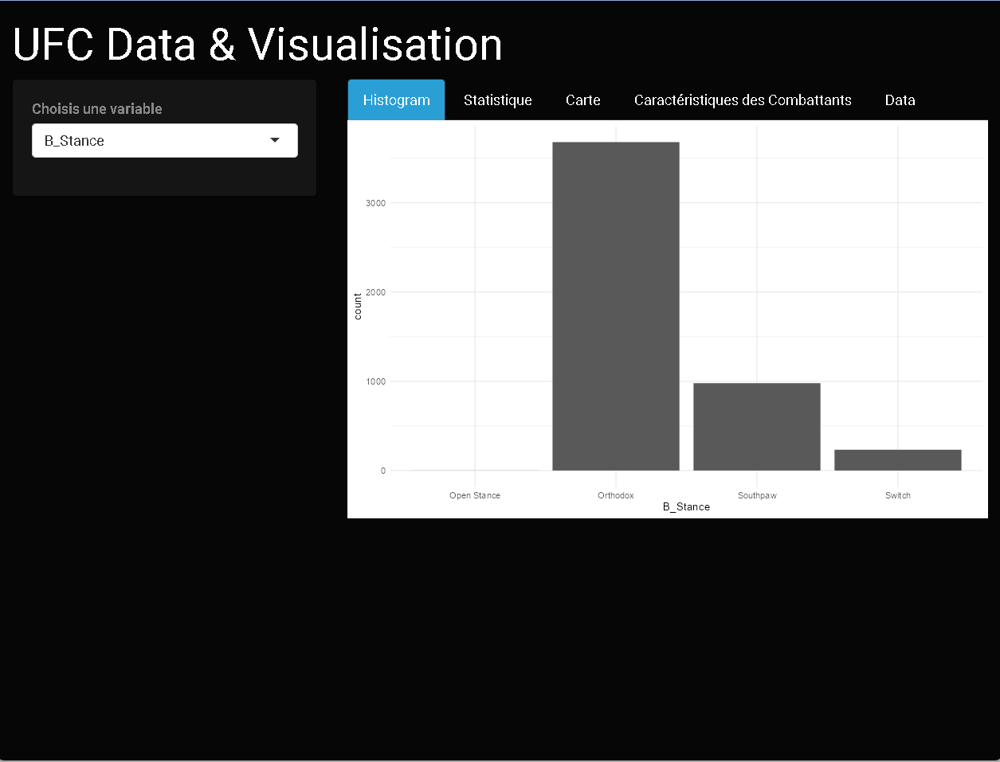

## Introduction and Overview

This Shiny application is designed for the visualization and analysis of UFC fighter data. It offers features such as interactive maps, graphs, and statistical analyses.

## What is the UFC?

The UFC, or Ultimate Fighting Championship, is a leading organization in the world of mixed martial arts (MMA). Founded in 1993, the UFC has played a crucial role in the global popularity of MMA. It hosts fights between highly skilled athletes from various combat disciplines, such as Brazilian Jiu-Jitsu, wrestling, boxing, kickboxing, and judo. The UFC is known for its spectacular events, bringing together the best fighters in the world for tournaments that test their skills and endurance. With its strict rules and competition format, the UFC has transformed MMA into a professional sport that is respected and followed by millions of fans worldwide.

## Table of Contents
- [Developer Guide](#developer-guide)
- [User Guide](#user-guide)
- [Analysis Report](#analysis-report)

## Developer Guide

Language: R

Framework: Shiny

Recommended IDE: RStudio

### Code Architecture:

app.R: Main entry point of the application.

sidebarPanelUI.R and mainPanelUI.R: UI for the sidebar and main panels.

prepareData.R: Data preprocessing script.

Map.R: Contains functions for creating graphs for the map tab.

Caracteristique.R: Contains functions for creating graphs for the characteristics tab.

Statistique.R: Contains functions for creating graphs for the statistics tab.

Histo.R: Contains functions for creating graphs for the histogram tab.

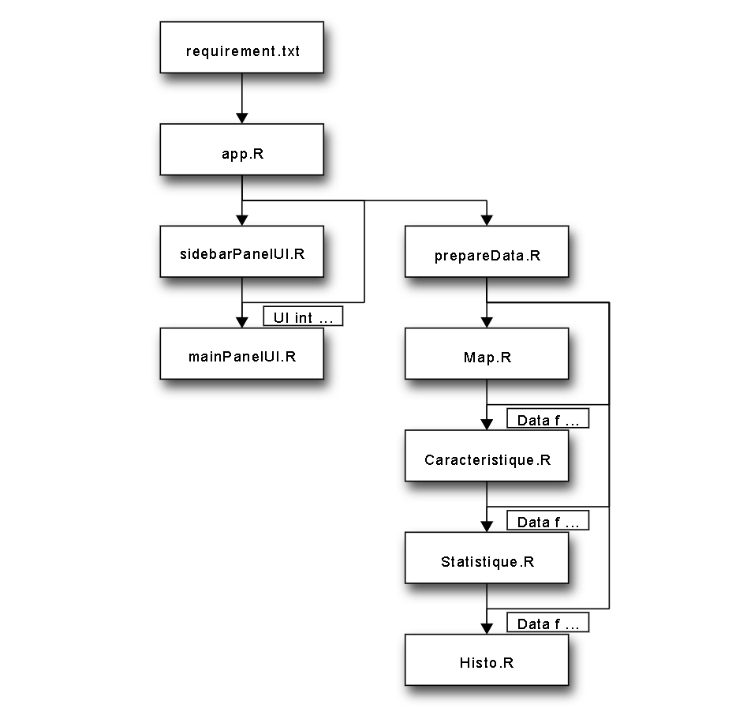


## User Guide

### Installing R and RStudio

- **R**: Provide a link to CRAN to download and install the latest version of R.
- **RStudio (optional but recommended)**: Provide a link to RStudio Download to download and install RStudio.

For the application to function correctly, you need to download Rtools.

Go to the terminal and run the following command:

```bash
git clone https://git.esiee.fr/renaulta/ufcproject_petris_renaultr.git
```

Once completed, open R or RStudio and navigate to the folder where the code is located with the following command:

```bash
setwd("path/to/your/folder/clone")
```

Once in the folder, type the following commands in the console:

```r
packages <- readLines("requirements.txt")
```

Install each package:

```r
for (pkg in packages) {
    if (pkg != "") {
        install.packages(pkg)
    }
}
library(shiny)
```

Launching the application:

```r
runApp("app.R")
```

This Shiny application offers an analysis of a UFC dataset. We attempted to identify various characteristics of fighters that might influence the outcomes of fights. A dedicated tab also allows you to view the individual characteristics of each fighter.

Within this application, you can navigate through different tabs such as Map, Data, Statistics, etc. Each tab offers different variables, each providing a specific type of information.

The Statistics tab presents a dynamic graph. You can select a reach, and based on that, the graph will display the percentage of victories for fighters with that reach.

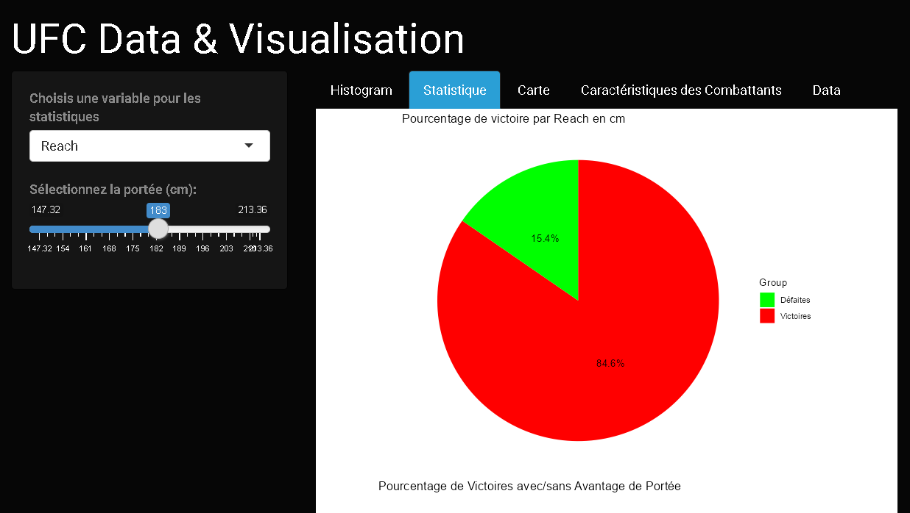

Another dynamic graph is located in the Characteristics tab. You can choose a fighter to view their detailed characteristics.

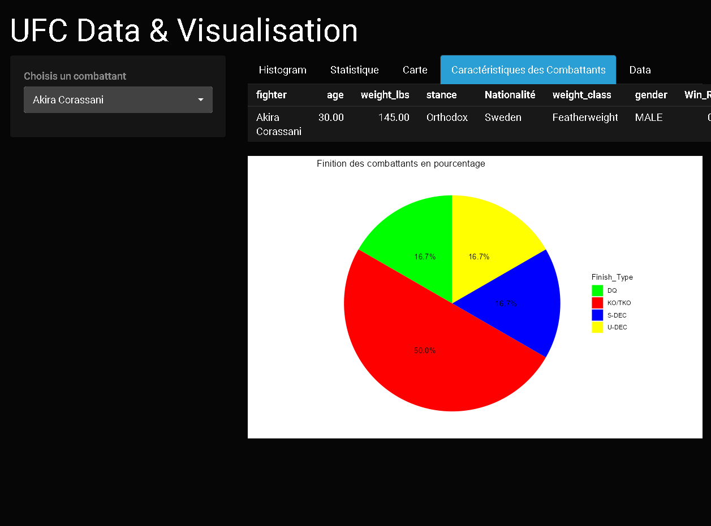

In the Data tab, it is possible to visualize the data, and a button allows you to download it.

## Analysis Report

### Categorical Data Analysis:

#### Stance

A fighter's stance, or combat posture, plays a crucial role in strategy and the effectiveness of attacks and defenses during a fight. For example, a southpaw fighter can present unexpected angles of attack for an orthodox fighter, while an open stance can offer unique opportunities for crossing strikes.

The **Stance** variable represents the combat posture of different fighters:

- **Orthodox**: Standard position for a right-handed fighter, with the right hand back and the left hand forward.
- **Southpaw**: The opposite of Orthodox, for a left-handed fighter, with the left hand back and the right hand forward.
- **Open Stance**: A confrontation between an orthodox and a southpaw fighter, where the front hands and feet are on the same side.
- **Switch**: The ability to switch between the orthodox and southpaw stances.

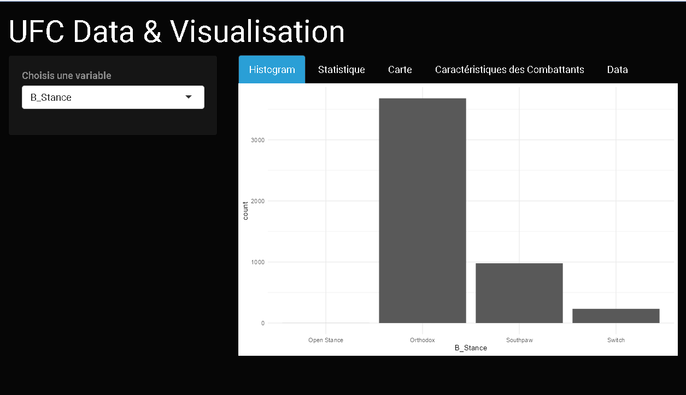  
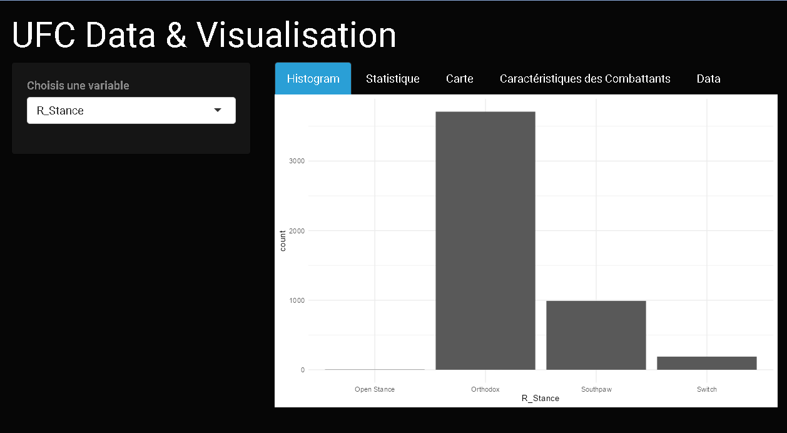

These two histograms reveal that there are significantly more Orthodox fighters than Southpaws, Switch, or Open Stance fighters. The limited number of fighters using the Switch or Open Stance styles makes it difficult to conduct in-depth analysis on these variables. However, this raises an interesting question: Do Orthodox fighters have an advantage against Southpaws?

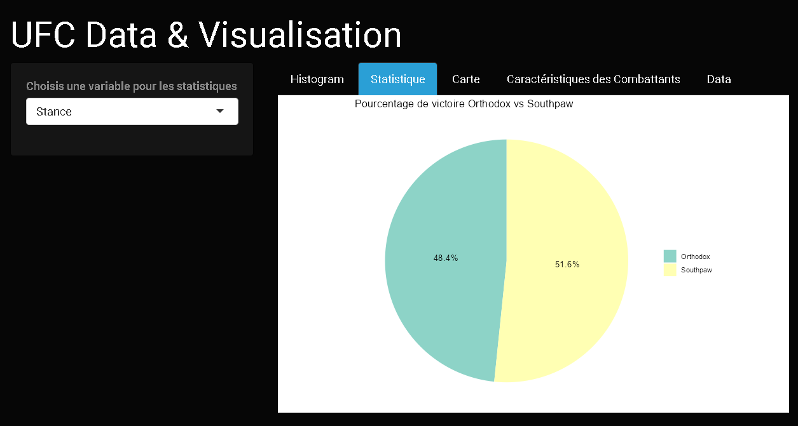

Theoretically, we could expect a higher win rate for Southpaw fighters, given that the majority of fighters are Orthodox and are not accustomed to facing Southpaws. Southpaws could surprise them with different angles of attack. However, our observations show that this is not the case. Southpaws have a win probability of 51.6% against Orthodox fighters, which is not significantly high.

### Finish

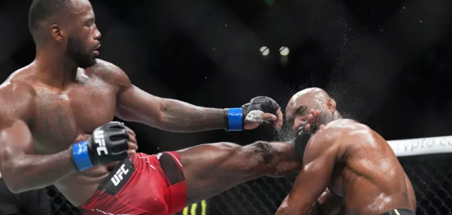

UFC MMA fights can end in various ways, each reflecting a distinct strategy and performance by the fighters. This histogram provides a detailed analysis of how most UFC fights are concluded.

- **U-DEC (Unanimous Decision)**: A unanimous decision is made by the judges at the end of the fight, meaning all judges agree on the winner.
- **KO/TKO (Knockout/Technical Knockout)**: A fighter wins by knocking out the opponent (KO) or forcing them to quit due to an inability to continue (TKO).
- **SUB (Submission)**: The victory is achieved by submission, meaning one fighter forces the opponent to tap out by applying a submission hold.
- **S-DEC (Split Decision)**: A split decision is made by the judges, meaning at least two judges disagree on the winner of the fight.
- **M-DEC (Majority Decision)**: A majority decision is made by the judges, meaning a majority of judges agree on the winner, but one judge may disagree.
- **DQ (Disqualification)**: A fighter is disqualified, leading to a victory for their opponent. This can occur due to serious rule violations or inappropriate behavior during the fight.

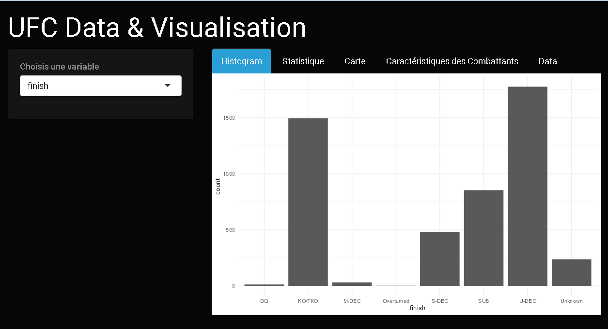

It is noticeable that most fights end with a decision, meaning there is no KO or submission within the allocated time, and the winner is determined by the judges. After that, the second most common way a fight ends is by KO.

### Finish Round

The outcome of rounds in UFC fights varies depending on several factors, including the duration of the match.

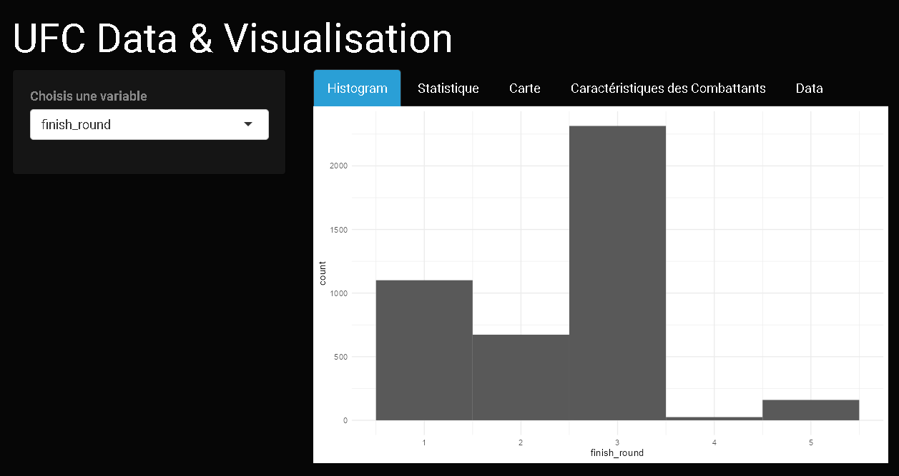

This histogram illustrates the distribution of fight endings in UFC rounds. Generally, a match lasts for 3 rounds, except for championship bouts, which are 5 rounds. Therefore, it is consistent to observe that very few fights end in the 5th round. The majority of fights conclude in the 3rd round, which makes sense since, as we saw earlier, most fights end with a judge's decision.

### Gender

This histogram illustrates the significant disparity between men and women in the sport of MMA. This is not the only combat sport where a large gender gap is observed, which is truly unfortunate.

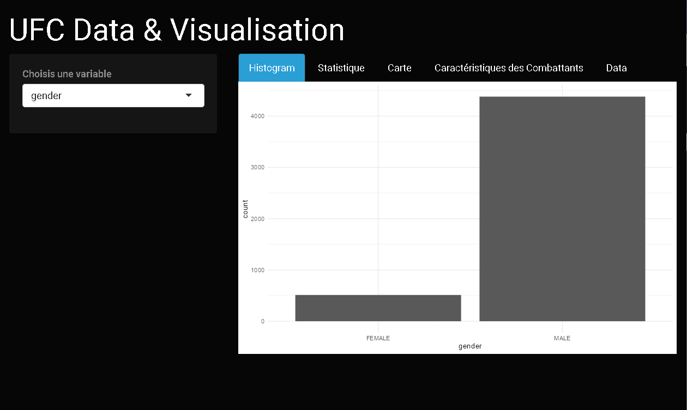

### Winner

This histogram represents the number of victories for fighters on the blue side versus the red side. It is logical that the Red side records more victories, as it typically includes the champions of each division as well as the main challengers.

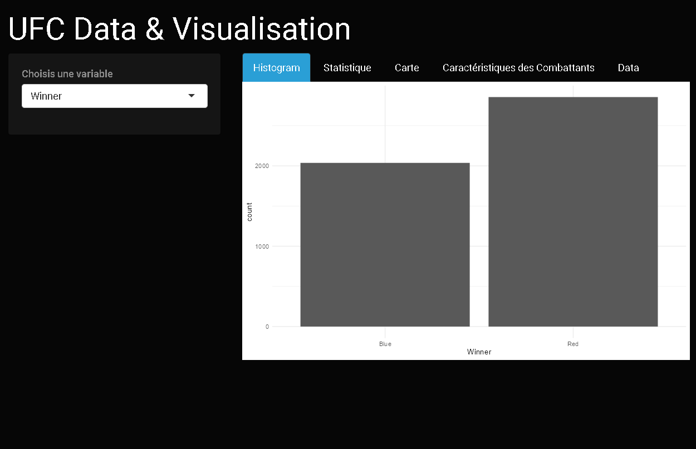

Next, let’s move to the Statistics tab:

### Reach
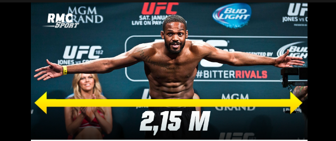

Reach in MMA is a key element that can offer a significant tactical advantage, greatly influencing the strategy and outcome of fights. Our analysis explores how a greater reach changes the dynamics of a fight, impacting a fighter's range, defense, and striking effectiveness.

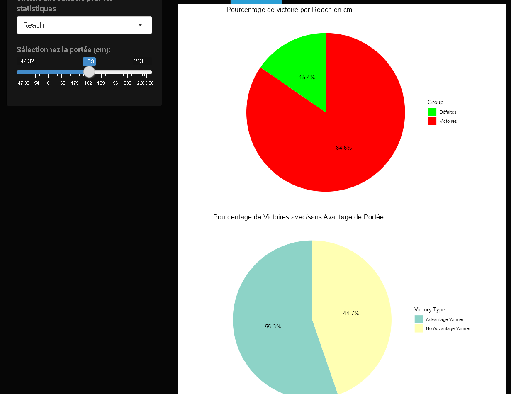  
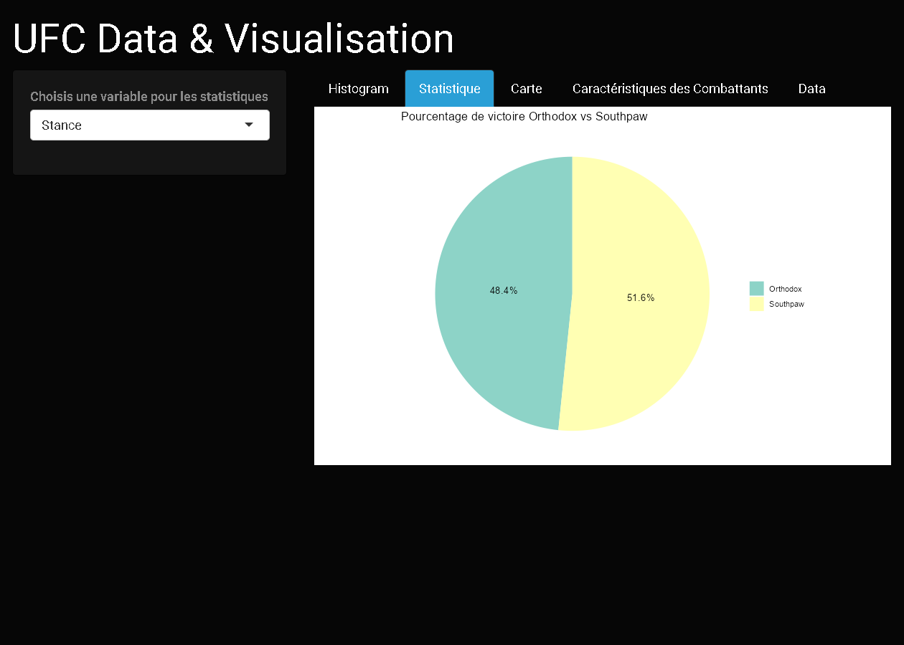

We decided to analyze the impact of reach on the outcome of various fights. Reach, or wingspan, refers to the distance between the tips of both outstretched arms horizontally, extending from the chest. This can represent a significant advantage. Our first graph shows the win percentage based on reach. Since many fighters share the same reach, this data is not necessarily significant. Therefore, we decided to examine the win percentage for fighters with a 10 cm reach advantage over their opponents. To our surprise, the results were closer than expected: fighters with an additional 10 cm of reach win more often. We could have conducted the same study with a 20 cm reach difference, but fights with such a difference are too rare.

### Significant Strikes & Decision

The analysis of the relationship between the number of significant strikes landed and judge decisions in different weight classes in MMA provides valuable insights into the dynamics of combat. By focusing on different weight classes, our study aims to decode how the frequency and effectiveness of strikes influence the outcome of fights. This approach allows us to examine the tactical and technical nuances that differentiate these weight classes, revealing interesting trends in combat strategies.

Weight plays a crucial role in determining the class of each fighter. Thus, we distinguish:

- **Flyweight**  
  Weight Limit: 56.7 kg (125 lb)  
  Description: The flyweight category is the lightest in the UFC. Fighters in this class are agile and fast, offering dynamic bouts with striking and submission techniques.

- **Bantamweight**  
  Weight Limit: 61.2 kg (135 lb)  
  Description: Fighters in the bantamweight class are quick and technical. Fights in this category are often characterized by a combination of power and agility.

- **Featherweight**  
  Weight Limit: 65.8 kg (145 lb)  
  Description: The featherweight category features fighters who are light but powerful. Fights in this category are known for their energy and intensity.

- **Lightweight**  
  Weight Limit: 70.3 kg (155 lb)  
  Description: Lightweight fighters offer a combination of speed, power, and endurance. The lightweight category is one of the most popular, with often spectacular bouts.

- **Welterweight**  
  Weight Limit: 77.1 kg (170 lb)  
  Description: Welterweight fighters are versatile, offering a combination of power and technical skill. This category is known for its intense competitiveness.

- **Middleweight**  
  Weight Limit: 83.9 kg (185 lb)  
  Description: Middleweights feature powerful and technical fighters. Fights in this category are often marked by high-level striking and grappling skills.

- **Light Heavyweight**  
  Weight Limit: 93.0 kg (205 lb)  
  Description: Light heavyweight fighters are powerful and agile. This category combines the strength of the heavyweights with the speed of lighter categories.

- **Heavyweight**  
  Weight Limit: No upper limit  
  Description: Heavyweight fighters are the largest in the UFC. With no upper weight limit, this category often features explosive bouts with phenomenal power.

Each weight class offers a unique dynamic, creating a diversity of strategic approaches and fighting styles within the UFC. These categories allow fighters to find the class that best matches their physical and technical skills, ensuring fair and exciting competitions.

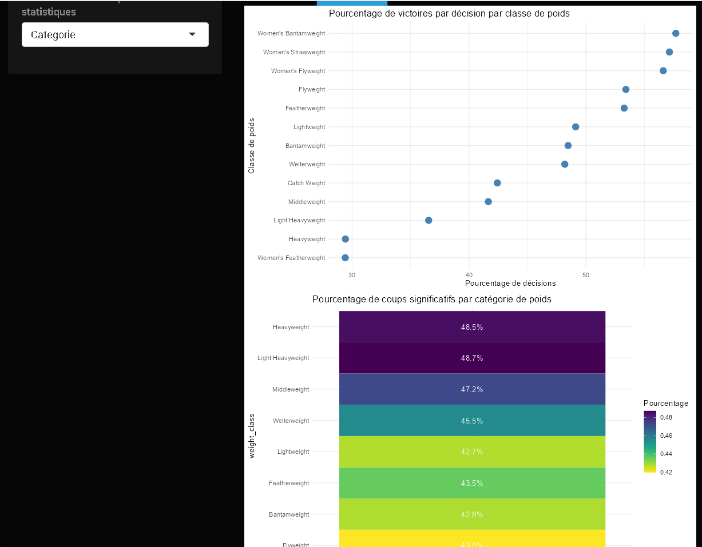

In this tab, our goal was to analyze the relationship between the number of significant strikes landed and the percentage of decisions in different weight classes. We observed that in the lightweight category, the percentage of significant strikes is lower (42%) compared to the heavier weight classes (48.5%). Lightweight fighters, being more agile, might have more difficulty landing strikes, while as the weight classes increase, fighters become less agile, are more likely to take hits, and are less enduring. Additionally, there seems to be a correlation between the percentage of significant strikes and decisions: the higher the percentage of strikes, the less likely the fight is to end in a decision, and vice versa, which makes sense.

### Age & Performance

In the world of combat sports, age is a central concern. While some professionals stress that it cannot be compared to experience, it is important to note that the physical performance of fighters is closely linked to their age.  
Thus, the techniques that can lead to victory by decision or by KO/TKO are, directly or indirectly, influenced by the fighters’ age.  
We decided to observe the evolution of the average number of significant strikes with the age of the fighters.  
There is indeed an influence, with the key parameter being between 25 and 30 years old. If the argument of "experience" plays a role in striking (stand-up fighting).

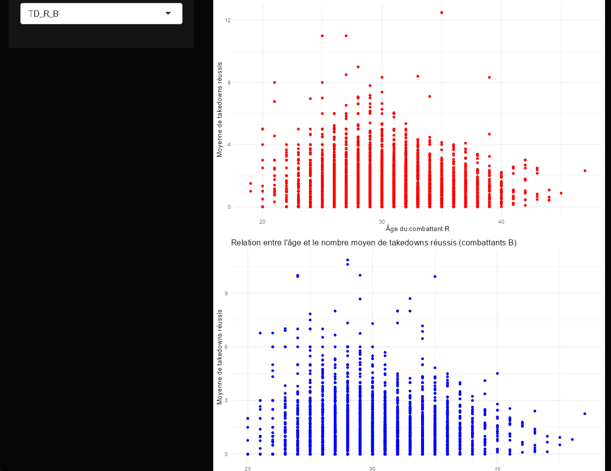

With this graph, our goal was to examine the influence of the fighters’ age on their average number of takedowns. It clearly appears that a significant trend emerges around the age of 30.

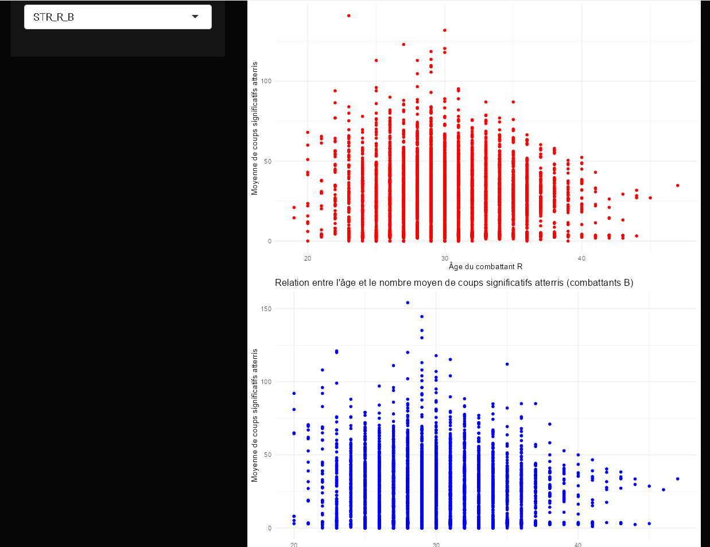

Similar to the previous graph, we sought to analyze the influence of the fighters' age on the average number of significant strikes landed. We observe a notable trend around 30 years old.

The objective of these two graphs was to determine the "prime" age of a fighter. Given that combat statistics are generally better around 30 years old, we could deduce that this is the age at which fighters are in their prime. Ideally, we would have liked to calculate the win percentage for each age group, but due to time constraints, this feature was not implemented.

### Map

Now, let’s move on to the Map tab:

This map illustrates the distribution of UFC fighters across different countries in the world. It is notable that the highest concentration of fighters is found on the American continent. In comparison, the number of European fighters is relatively low, which could be attributed to the former bans on this combat sport in Europe, where it was considered too violent.

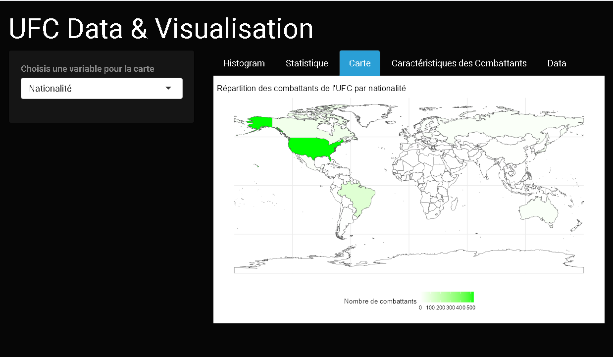

In this second map, we show the distribution of UFC events. The majority of these events take place on the American continent, which is consistent given that most fighters are of American origin.

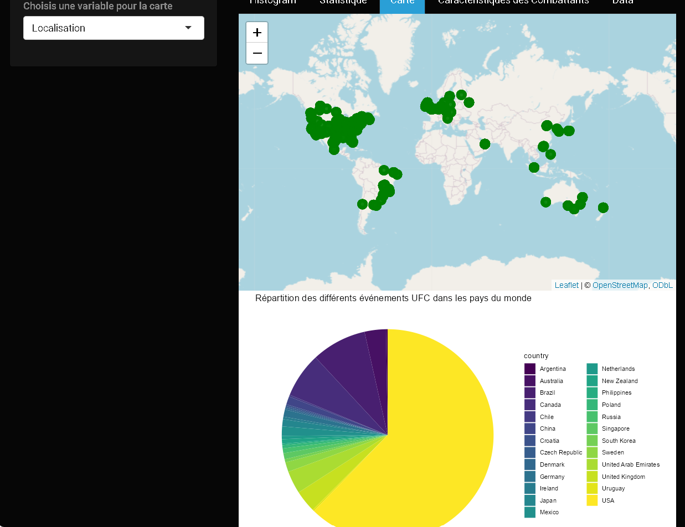

### Characteristics

In this tab, we have grouped the different characteristics of fighters. You can search for your favorite fighter and see their attributes. Additionally, there is a graph that shows how they finished most of their fights.

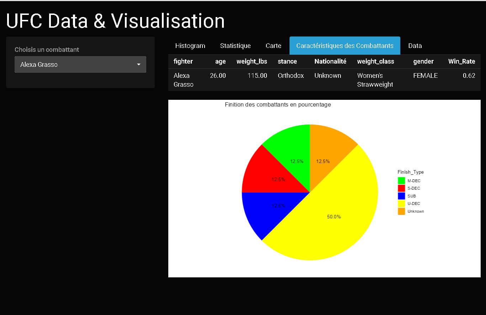

## Going Further

From the analyses conducted earlier, it becomes interesting to explore the correlation between the difference in reach, height, and the probability of winning.  
Here, to ensure the accuracy of this analysis, calculating a correlation matrix or simple correlation coefficients could be appropriate.  
It also makes sense to analyze the evolution of the distribution of origins over the years. The league has continuously evolved and now counts more and more fighters from diverse origins.  
Therefore, an interactive pie chart here would seem interesting.  
One method of execution would be to calculate the frequency of origins for a fixed year.  
Then, by varying the year using a slider, the pie chart would refresh based on the different temporal values in our dataframe. For the sake of data quantity, the refresh should only be done for years between 1 and 4 years.  
The same reasoning applies to the distribution of locations where UFC fights take place.  
Additionally, an analysis of the distribution of KOs according to weight categories could confirm the saying made by many combat sports enthusiasts that the heavier the weight, the greater the knockout power.  
Thus, we could expect, just as for the distribution of the average number of significant strikes, a higher number of KOs in the heavier weight classes.  
The execution method of this sequence could be based on calculating the frequency of KOs according to the 'finish' column for each weight class.  
Finally, it might be worth visualizing the combat trends of fighters according to their origins. Indeed, different origins imply various combat methods, techniques, and habits.  
For instance, we could analyze the prominence of takedowns for Russian and American fighters, as wrestling is a dominant sport in these territories.  
The same applies to successful submissions, as the rear-naked choke is a central submission in Brazilian Jiu-Jitsu.  
Many options are possible here. One idea would be to implement all the averages of successful submissions/takedowns on a map using scatter_geo.  
The bubbles would take the size and color based on the average number of successful submissions/takedowns by region. Other variables could also be interesting to analyze in this way, such as the average number of significant strikes.

### Conclusion

In conclusion, our Shiny UFC application has highlighted crucial aspects of MMA in the UFC, offering both confirmations of certain hypotheses and surprises. These analyses contribute to a better understanding of this complex and dynamic sport, and open the door to further research and exploration in the field of mixed martial arts. 


Nous avons parfois utilisé chatgpt pour corriger certaines erreurs.
