## French Version:
# Mon Application Shiny UFC

## Interface
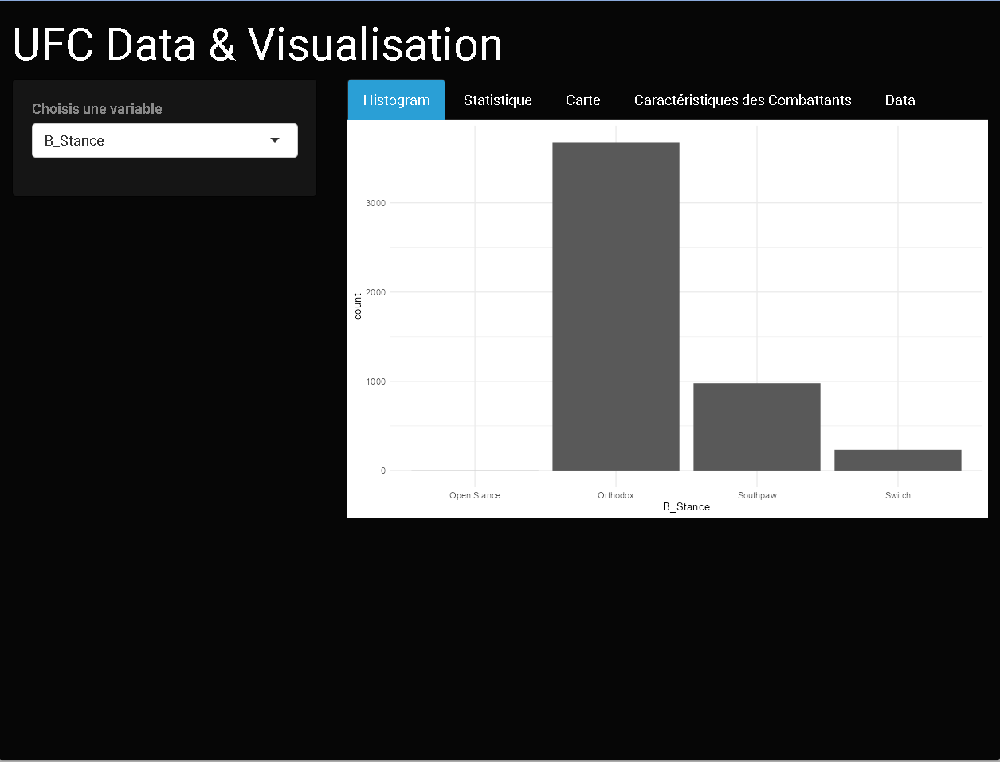


## Introduction et Vue d'Ensemble

Cette application Shiny est conçue pour la visualisation et l'analyse des données des combattants de l'UFC. Elle propose des fonctionnalités telles que des cartes interactives, des graphiques et des analyses statistiques.

## C'est quoi l'ufc?

L'UFC, ou Ultimate Fighting Championship, est une organisation de premier plan dans le monde des arts martiaux mixtes (MMA). Fondée en 1993, l'UFC a joué un rôle crucial dans la popularisation du MMA à l'échelle mondiale. Elle organise des combats entre des athlètes hautement qualifiés dans diverses disciplines de combat, telles que le jiu-jitsu brésilien, la lutte, la boxe, le kickboxing, et le judo. L'UFC est reconnue pour ses événements spectaculaires, rassemblant les meilleurs combattants du monde dans des tournois qui testent leurs compétences et leur endurance. Avec ses règles strictes et son format de compétition, l'UFC a transformé le MMA en un sport professionnel respecté et suivi par des millions de fans à travers le monde.

## Table des Matières
- [Guide Développeur](#guide-développeur)
- [Guide Utilisateur](#guide-utilisateur)
- [Rapport d'Analyse](#rapport-danalyse)


## Guide du dévelopeur

Langage : R 
                                                          
Framework : Shiny                                               
                                                             
IDE recommandé : RStudio

### Architecture du Code:

app.R : Point d'entrée principal de l'application.

sidebarPanelUI.R et mainPanelUI.R : UI pour les panneaux latéral et principal.

prepareData.R : Script de prétraitement des données.

Map.R : Contient les fonctions qui créent les graphes de l'onglet carte.

Caracteristique.R : Contient les fonctions qui créent les graphes de l'onglet caractéristique.

Statistique.R : Contient les fonctions qui créent les graphes de l'onglet statistiques.

Histo.R : Contient les fonctions qui créent les graphes de l'onglet histogramme.

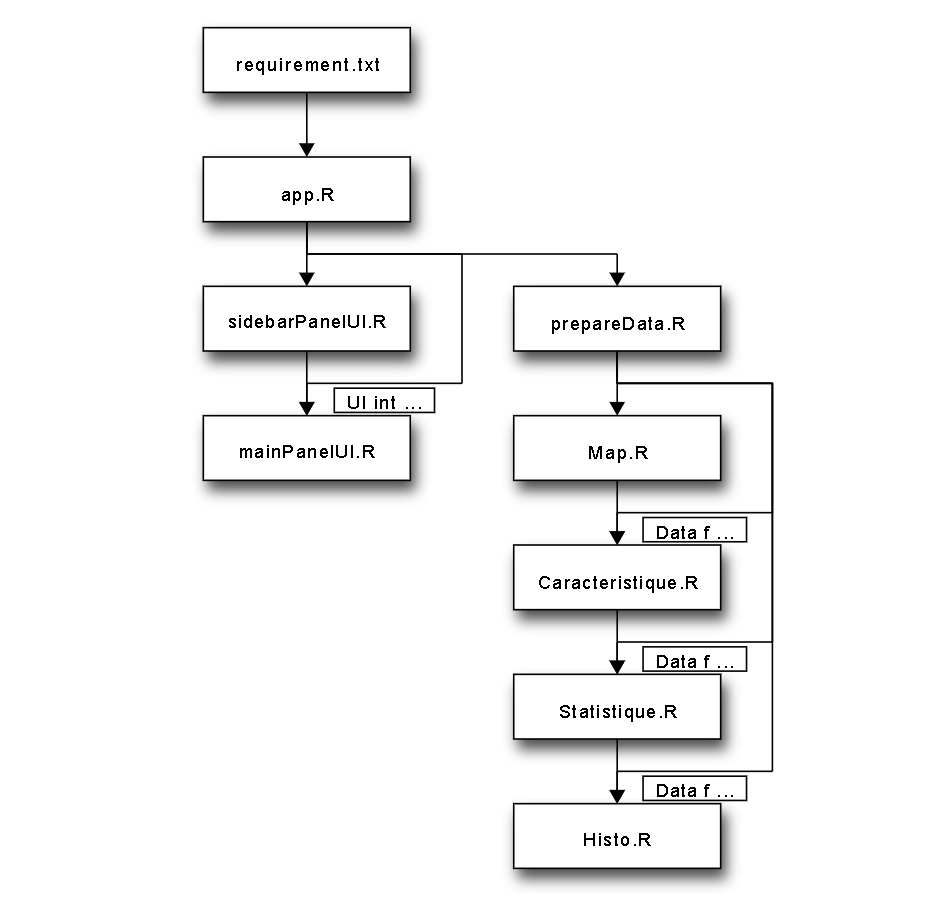

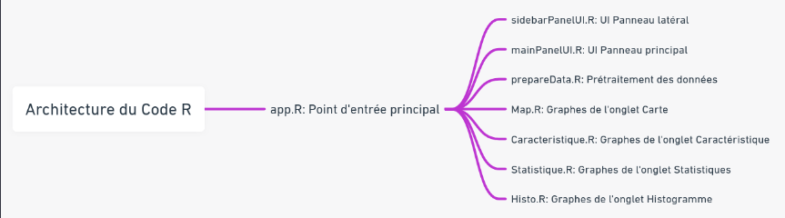

## Guide Utilisateur

Installation de R et RStudio

R : Fournissez un lien vers CRAN pour télécharger et installer la dernière version de R.

RStudio (optionnel mais recommandé) : Fournissez un lien vers RStudio Download pour télécharger et installer RStudio.

Pour le bon fonctionnement de l'application il faut telecaharger Rtools

Aller dans le terminal et effectuer la commande suivant:        

    git clone https://git.esiee.fr/renaulta/ufcproject_petris_renaultr.git

Une fois cela effectuer ouvrer R ou Rstudio on se placera dans le fichier ou ce trouve le code avec la commande suivant:

    setwd("chemin/d'acces au au fichier/clone")

Une fois dans ce fichier dans la console vous ecrirez les commande suivante

    packages <- readLines("requirements.txt")

Installer chaque package:

    for (pkg in packages) {
        if (pkg != "") {
        install.packages(pkg)
        }
    }
    library(shiny)

Lancement de l'application:

    runApp("app.R")


Cette application Shiny propose une analyse d'un dataset de l'UFC. Nous avons tenté d'identifier diverses caractéristiques des combattants susceptibles d'influencer les issues des combats. Un onglet dédié permet également de consulter les caractéristiques individuelles de chaque combattant.

Au sein de cette application, vous pouvez naviguer entre différents onglets tels que Carte, Data, Statistiques, etc. Chaque onglet propose différentes variables, chacune offrant un type d'information spécifique.

L'onglet Statistiques présente un graphique dynamique. Vous pouvez y sélectionner une allonge et, en fonction de celle-ci, le graphique affichera le pourcentage de victoires des combattants ayant cette allonge.

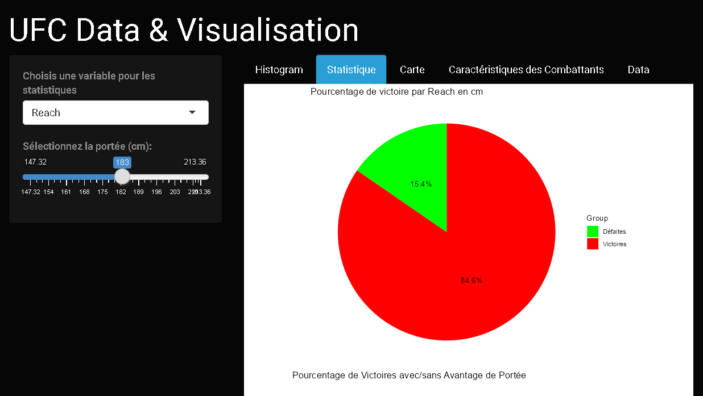

Un autre graphique dynamique se trouve dans l'onglet Caractéristiques. Vous pouvez y choisir un combattant pour afficher ses caractéristiques détaillées.

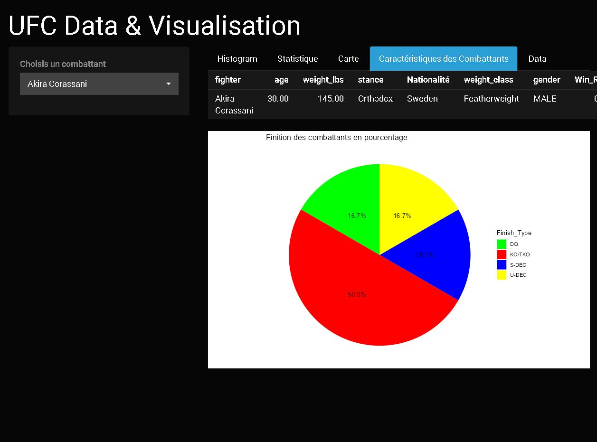

Dans l'onglet Data, il est possible de visualiser les données, et un bouton permet de les télécharger.


## Rapport d'analyse

Analyse des données categorielle:

## Stance

La stance d'un combattant, ou sa posture de combat, joue un rôle crucial dans la stratégie et l'efficacité des attaques et défenses lors d'un combat. Par exemple, un combattant gaucher peut présenter des angles d'attaque inattendus pour un adversaire orthodoxe, tandis qu'une stance ouverte peut offrir des opportunités uniques pour des frappes croisées. 

Stance la variable Stance represente la posture de combat des different combattants:

Orthodoxe : Position standard pour un droitier, main droite en arrière, main gauche en avant.

Gaucher  : Inverse de l'orthodoxe, pour un gaucher, main gauche en arrière, main droite en avant.

Open Stance : Affrontement entre un orthodoxe et un gaucher, les mains et pieds avants sont du même côté.

Switch : Capacité à changer entre les positions orthodoxe et gaucher.

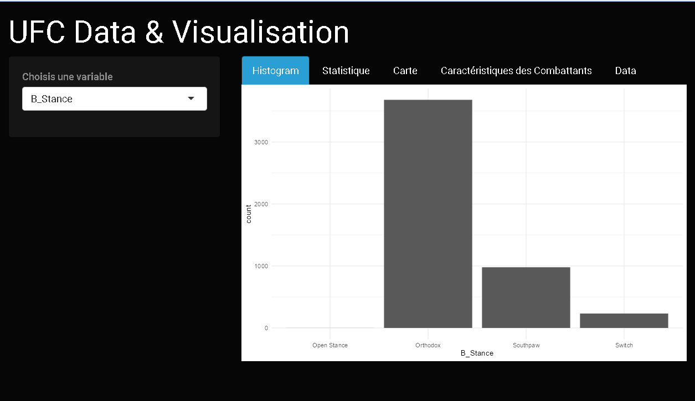
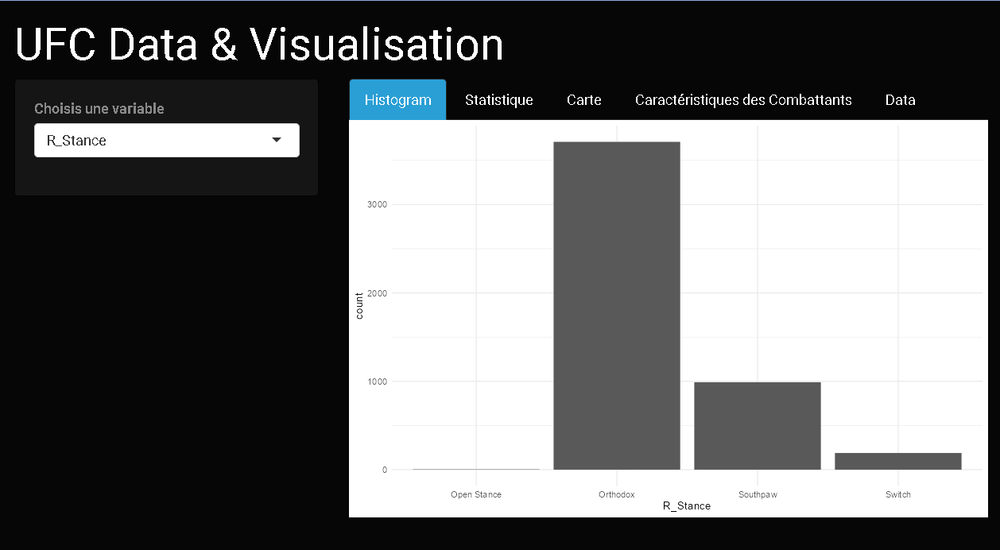

Ces deux histogrammes révèlent qu'il y a nettement plus de combattants Orthodoxes que de Southpaws, Switch ou Open Stance. Le nombre limité de combattants utilisant les styles Switch ou Open Stance rend difficile une étude approfondie sur ces variables. Cependant, cela soulève une question intéressante : les combattants Orthodoxes ont-ils un avantage ou non contre les Southpaws ?

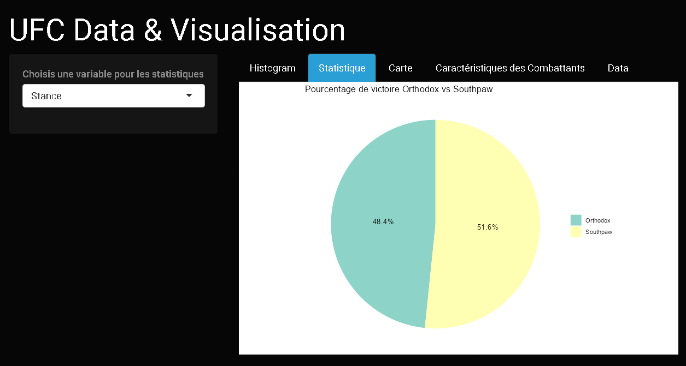

Théoriquement, on pourrait s'attendre à un taux de victoire élevé pour les combattants Southpaw, étant donné que la majorité des combattants sont Orthodoxes et n'ont pas l'habitude d'affronter des Southpaws. Ces derniers pourraient les surprendre avec des angles d'attaque différents. Cependant, nos observations montrent que ce n'est pas le cas. Les Southpaws ont une probabilité de victoire de 51,6 % contre des combattants Orthodoxes, ce qui n'est pas significativement élevé.


### Finish

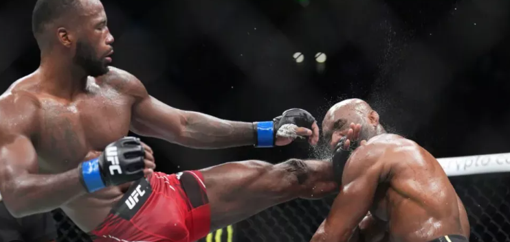

Les combats de MMA à l'UFC peuvent se terminer de différentes manières, chacune reflétant une stratégie et une performance distinctes des combattants. Cet histogramme offre une analyse détaillée de la manière dont se concluent la plupart des combats à l'UFC.

U-DEC (Unanimous Decision):
Description: Une décision unanime est rendue par les juges à la fin du combat. Cela signifie que tous les juges sont d'accord sur le vainqueur du combat.

KO/TKO (Knockout/Technical Knockout):
Description: Un combattant remporte le combat en mettant son adversaire KO (Knockout) ou en le forçant à abandonner en raison de l'incapacité de continuer (Technical Knockout).

SUB (Submission):
Description: La victoire est obtenue par soumission, c'est-à-dire qu'un combattant force son adversaire à abandonner en appliquant une prise de soumission.

S-DEC (Split Decision):
Description: Une décision partagée est rendue par les juges. Cela signifie qu'il y a un désaccord entre au moins deux des juges quant au vainqueur du combat.

M-DEC (Majority Decision):
Description: Une décision à la majorité est rendue par les juges. Cela signifie qu'une majorité des juges est d'accord sur le vainqueur, mais il peut y avoir un juge en désaccord.

DQ (Disqualification):
Description: Un combattant est disqualifié, entraînant la victoire de son adversaire. Cela peut être dû à des infractions graves aux règles ou à des comportements inappropriés pendant le combat.

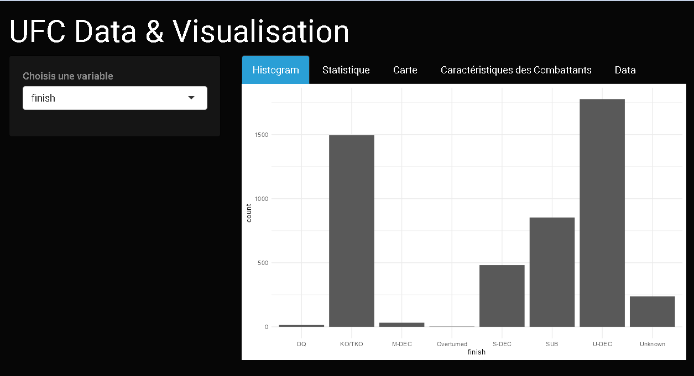

On remarque que la majorité des combats se concluent par une décision, c'est-à-dire qu'il n'y a ni KO ni soumission dans le temps imparti, et que le vainqueur est déterminé par les juges. Ensuite, la deuxième cause la plus fréquente de fin de combat est le KO.

### Finish round

L'issue des rounds dans les combats de l'UFC varie en fonction de plusieurs facteurs, notamment la durée du match. 

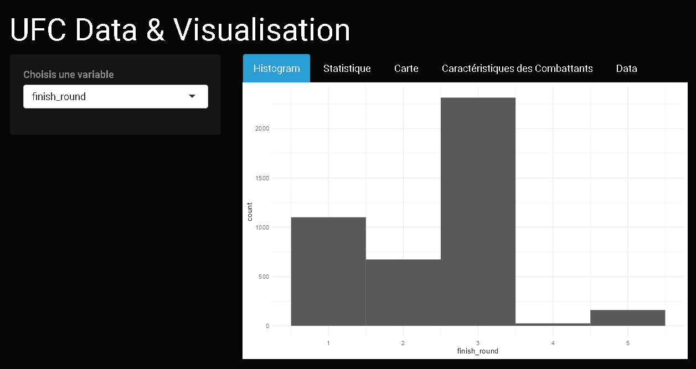

Cet histogramme illustre la répartition des fins de rounds à l'UFC. Généralement, un match se déroule en 3 rounds, sauf pour les combats de championnat de catégorie, qui se jouent en 5 rounds. Il est donc cohérent de constater qu'il y a très peu de combats qui se terminent au 5ème round. La majorité des combats se concluent au 3ème round, ce qui est logique étant donné que, comme nous l'avons vu précédemment, la plupart des combats se terminent par une décision des juges.


### Gender

Cet histogramme illustre la grande disparité entre les hommes et les femmes dans ce sport de combat, le MMA. Ce n'est pas le seul sport de combat où l'on observe une grande disparité entre les hommes et les femmes, ce qui est vraiment dommage.

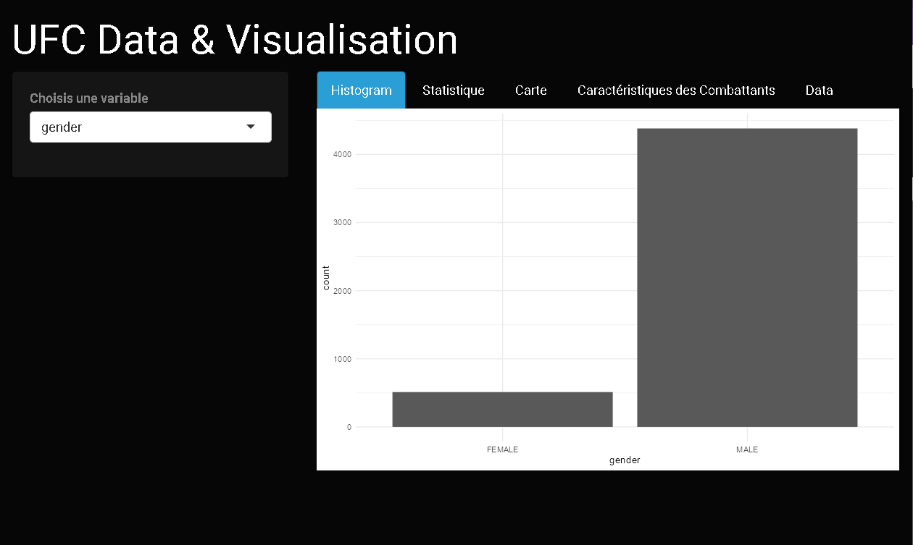


### Winner 

Cet histogramme représente le nombre de victoires des combattants du côté bleu (Blue side) et du côté rouge (Red side). Il est logique de constater que le Red side enregistre plus de victoires, car il inclut généralement les champions de chaque catégorie ainsi que les challengers principaux.

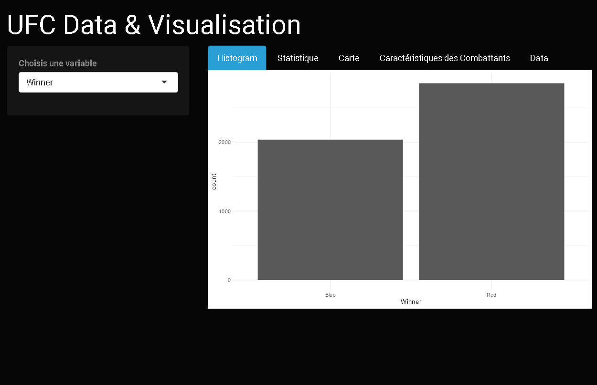


Passons maintenant à l'onglet Statistiques :

### Allonge 
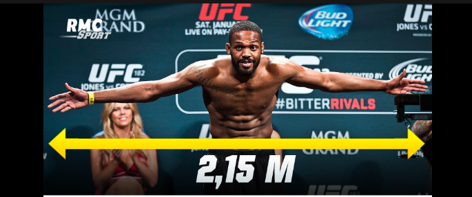


L'allonge en MMA est un élément clé qui peut offrir un avantage tactique notable, influençant considérablement la stratégie et l'issue des combats. Notre analyse explore comment une allonge supérieure modifie la dynamique du combat, en impactant la portée, la défense et l'efficacité des attaques des combattants.

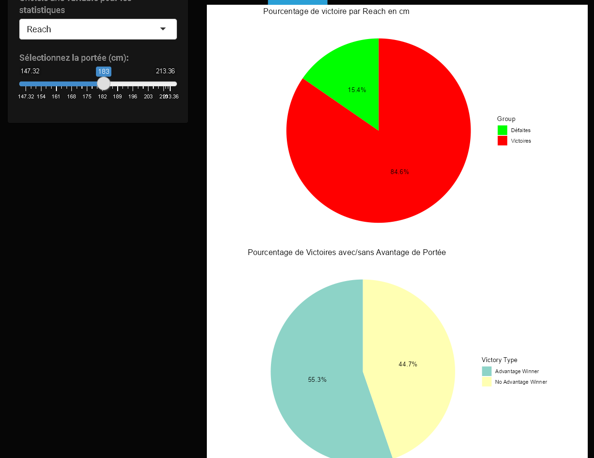
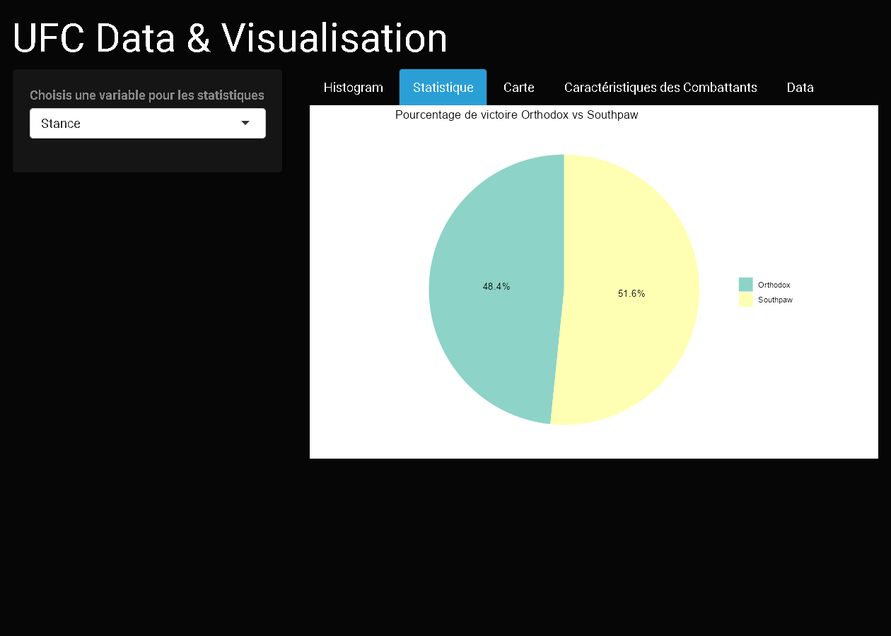

Nous avons décidé d'analyser l'impact de l'allonge sur l'issue des différents combats. L'allonge, ou envergure, désigne la distance entre les extrémités des deux bras tendus à l'horizontale, dans le prolongement de la poitrine. Cela peut représenter un avantage significatif. Notre premier graphique montre le pourcentage de victoires en fonction de l'allonge. Étant donné que de nombreux combattants partagent la même allonge, cette donnée n'est pas nécessairement pertinente. Nous avons donc décidé d'examiner le pourcentage de victoires pour les combattants ayant 10 cm d'allonge de plus que leurs adversaires. À notre grande surprise, les résultats sont plus serrés que prévu : les combattants avec 10 cm d'allonge supplémentaire gagnent plus souvent. Nous aurions pu réaliser la même étude avec une différence d'allonge de 20 cm, mais les combats présentant une telle différence sont trop rares.

### Coup significatif & décision

L'analyse de la relation entre le nombre de coups significatifs portés et les décisions des juges dans différentes catégories de poids en MMA offre des insights précieux sur les dynamiques de combat. En se concentrant sur differente catégories  de , notre étude vise à déchiffrer comment la fréquence et l'efficacité des coups influencent l'issue des combats. Cette approche nous permet d'examiner les nuances tactiques et techniques qui différencient ces catégories, révélant des tendances intéressantes dans les stratégies de combat.
Le poids important lors d'un combat est délimité en catégories pour chaques combattants. Ainsi on distingue :

Poids Mouche (Flyweight)
Limite de Poids: 56.7 kg (125 lb)
Description: La catégorie des poids mouches est la plus légère de l'UFC. Les combattants de cette catégorie sont agiles et rapides, offrant des combats dynamiques avec des techniques de frappe et de soumission.

Poids Coq (Bantamweight)
Limite de Poids: 61.2 kg (135 lb)
Description: Les combattants de la catégorie des poids coqs sont rapides et techniques. Les combats de cette catégorie sont souvent caractérisés par une combinaison de puissance et d'agilité.

Poids Plume (Featherweight)
Limite de Poids: 65.8 kg (145 lb)
Description: La catégorie des poids plumes présente des combattants légers mais puissants. Les combats dans cette catégorie sont connus pour leur énergie et leur intensité.

Poids Léger (Lightweight)
Limite de Poids: 70.3 kg (155 lb)
Description: Les combattants légers offrent une combinaison de vitesse, de puissance et d'endurance. La catégorie des poids légers est l'une des plus populaires, avec des combats souvent spectaculaires.

Poids Mi-Moyen (Welterweight)
Limite de Poids: 77.1 kg (170 lb)
Description: Les combattants de la catégorie des poids mi-moyens sont polyvalents, offrant une combinaison de puissance et d'habiletés techniques. Cette catégorie est connue pour sa compétitivité intense.

Poids Moyen (Middleweight)
Limite de Poids: 83.9 kg (185 lb)
Description: Les poids moyens présentent des combattants puissants et techniques. Les combats dans cette catégorie sont souvent marqués par des compétences de frappe et de grappling de haut niveau.

Poids Lourd Léger (Light Heavyweight)
Limite de Poids: 93.0 kg (205 lb)
Description: Les combattants de la catégorie des poids lourds légers sont puissants et agiles. Cette catégorie combine la force des poids lourds avec la vitesse des catégories plus légères.

Poids Lourd (Heavyweight)
Limite de Poids: Pas de limite supérieure
Description: Les poids lourds sont les combattants les plus massifs de l'UFC. Avec aucune limite de poids supérieure, cette catégorie présente souvent des combats explosifs mettant en jeu une puissance phénoménale.
Chaque catégorie de poids offre une dynamique unique, créant une diversité d'approches stratégiques et de styles de combat au sein de l'UFC. Ces catégories permettent aux combattants de trouver la classe de poids qui correspond le mieux à leurs compétences physiques et techniques, assurant des compétitions équitables et passionnantes.

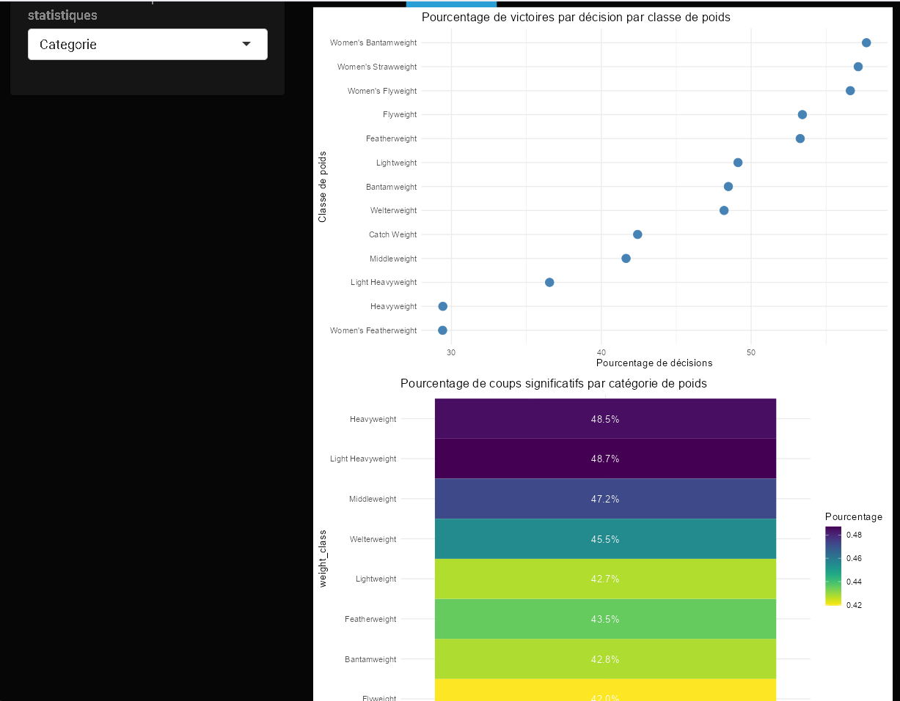

Dans cet onglet, notre objectif était d'analyser la relation entre le nombre de coups significatifs portés et le pourcentage de décisions dans différentes catégories de poids. Nous avons observé que, dans la catégorie des poids légers, le pourcentage de coups significatifs est moins élevé (42 %) comparé à celui des catégories poids lourds (48,5 %). Les combattants de la catégorie poids légers, étant plus agiles, pourraient avoir plus de difficulté à toucher leurs adversaires, tandis que plus on monte en catégorie de poids, moins les combattants sont agiles, plus susceptibles de prendre des coups et moins endurants. De plus, il semble exister une corrélation entre le pourcentage de coups significatifs et les finitions par décision : plus ce pourcentage est élevé, moins le combat a tendance à se terminer par une décision, et vice-versa, ce qui est logique.


### Age & performence 

Dans le monde des sports de combats, l'age est au centre des préoccupation.Pendant que certains professionels du sport tiennent à préciser que cela ne se compare pas à l'experience, il est utile de noter que les performances physiques des combattants sont intimements liées à leurs ages.
Ainsi, l'ensemble des techniques pouvant être liés à la victoire par décisions ou par KOs/TKos a à voir de loin ou de près avec l'age de nos combattants.
On décide alors d'observer l'évolution de la moyenne des coups significatifs avec l'age de nos combattants.
On observe bel et bien une influence, avec le paramètre étant prédominant entre 25 et 30 ans.Si l'argument de "l'experience" intervient lors du striking (combat pieds-poings) .

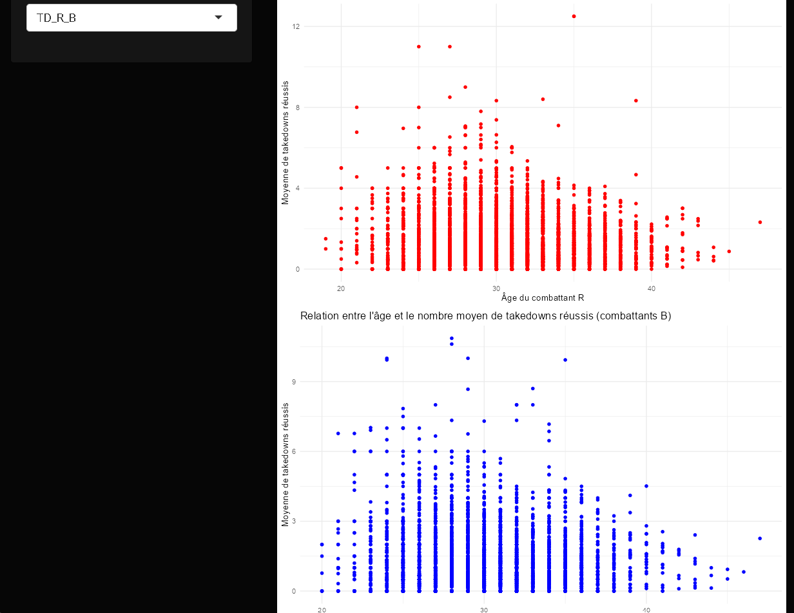

Avec ce graphique, notre objectif était d'examiner l'influence de l'âge des combattants sur leur moyenne de take-downs. Il apparaît clairement qu'une tendance significative se dessine autour de l'âge de 30 ans.

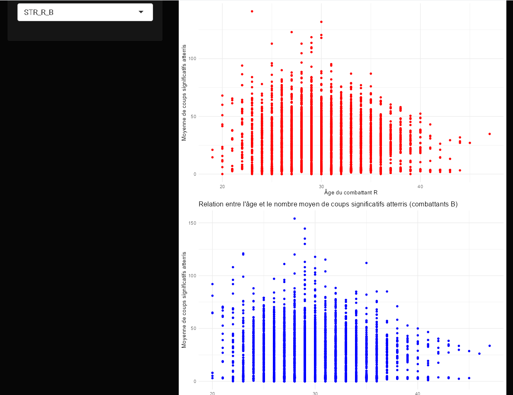

Comme le graphique précédent, nous avons cherché à analyser l'influence de l'âge des combattants sur la moyenne des coups significatifs portés. Nous observons une tendance notable autour de 30 ans.

L'objectif de ces deux graphiques était de déterminer l'âge 'prime' d'un combattant. Étant donné que les statistiques de combat sont généralement meilleures vers 30 ans, on pourrait en déduire que c'est à cet âge que les combattants sont dans leur prime. Idéalement, nous aurions aimé calculer un pourcentage de victoires pour chaque tranche d'âge, mais par manque de temps, cette fonctionnalité n'a pas été implémentée.


### Carte 

Passons maintenant à l'onglet Carte :

Cette carte illustre la répartition des combattants de l'UFC dans différents pays du monde. Il est notable que la concentration la plus élevée de combattants se trouve sur le continent américain. En comparaison, le nombre de combattants européens est relativement faible, ce qui pourrait être attribué aux anciennes interdictions de ce sport de combat en Europe, où il était jugé trop violent.

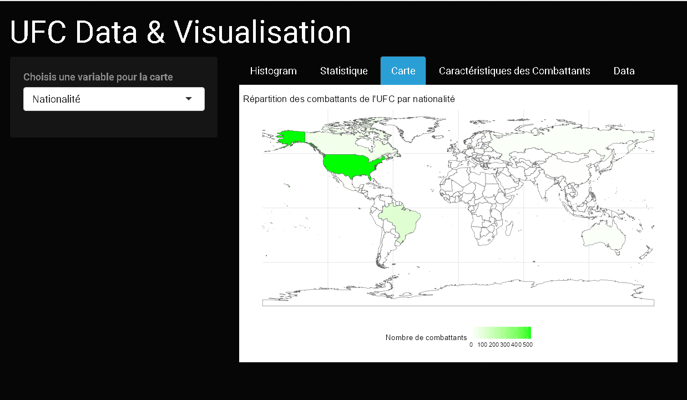

Dans cette deuxième carte, nous présentons la répartition des événements de l'UFC. La majorité de ces événements se déroulent sur le continent américain, ce qui est cohérent étant donné que la plupart des combattants sont d'origine américaine.

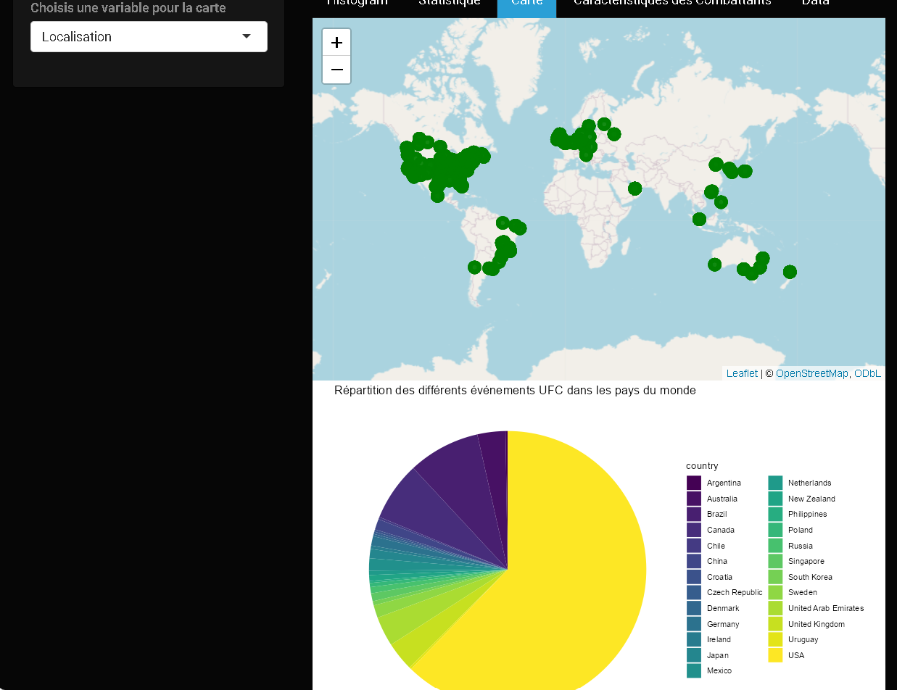


### Caracteristique

Dans cet onglet, nous avons regroupé les différentes caractéristiques des combattants. Vous pouvez chercher votre combattant préféré et voir ses caractéristiques. De plus, vous avez un graphe qui vous informe de la manière dont il a fini la plupart de ses combats.

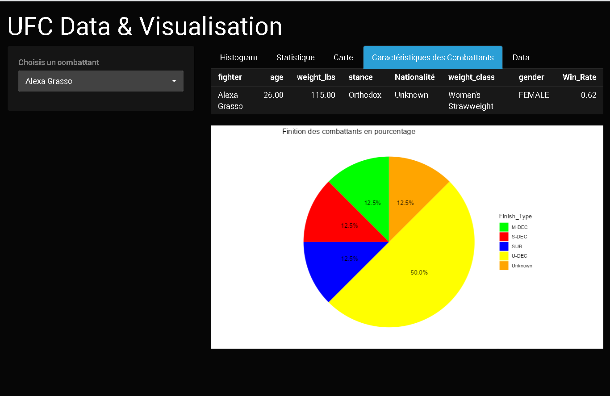


## Aller plus loin


A partir des analyses faite précedemment, il devient intéressant  de chercher une corrélation entre la différence de reach, de taille et la probabilité de victoire.
Ici pour être sûr de cette analyse, le calcul d'une matrice de corrélation ou de simples coefficients de corrélation, peut être approprié.
Il devient aussi censé d'analyser l'évolution de la répartition des origines à travers les années.La ligue n'ayant cessé d'évoluer et comptant de plus en plus de combattants d'origines diverses.
Ainsi un pie chart intéractif ici semblerait intéressant.
Une méthode d'executiion consisterai à calculer la fréquence des origines pour une date fixé.
Puis en faisant varier la date selon un curseur, il s'agira de rafraichir le pie chart selon les diverses valeurs temporelles dans notre dataframe.Par soucis de quantité de données le rafraichissement ne devrait être fait que pour des années entre 1-4 ans.
Le même raisonnement s'applique alors pour la répartition des lieux où se déroulent les combats UFC.
De plus, une analyse de la repartion des KOs selon les catégories de poids permettrait de confirmer l'adage fait par de nombreux adeptes de sports de combats selon lequel plus le poids est important plus la force de frappe l'est.
Ainsi l'on pourrait s'attendre tout comme pour la réparition de la moyenne du nombre de frappes significatives à avoir un nombre de KO plus important pour les catégories les plus lourdes.
La méthode d'execution de cette séquence pourrait se baser sur le calcul de la fréquence des KOs selon la colonne 'finish' pour chaque catégories de poids.
Il pourrait enfin s'agir de renvoyer un histogramme entre la dite fréquence et les catégories de poids.
Notons enfin qu'il serait valable visualiser les tendances de combat des combattants selon leurs origines. En effet, différentes origines impliquent diverses méthodes de combats, techniques et habitudes. Ainsi on pourrait analyser la prominence du takedown pour des combattants russes et américains, la lutte étant un sport dominant en ces territoires.
Il en est de même pour l'ensemble des soumissions réussis.Le rear naked choke étant une soumission centrale en jiu jitsu brésilien.
De nombreuses options sont possibles ici. Une idée serait d'implémenter l'ensemble des moyennes de soumissions/takedown réussies sur une carte à l'aide de scatter_geo.
Les bulles prendraient la taille et la couleur de la moyenne des soumissions/takedown réussis par territoires. D'autres variables pourraient aussi être intéréssant à analyser de cette manière telle que la moyenne des frappes significatives.


### Conclusion 

En conclusion, notre application Shiny UFC a permis de mettre en lumière des aspects cruciaux du MMA à l'UFC, offrant à la fois des confirmations de certaines hypothèses et des surprises. Ces analyses contribuent à une meilleure compréhension de ce sport complexe et dynamique, et ouvrent la voie à de futures recherches et explorations dans le domaine des arts martiaux mixtes.


## English Version

# My Shiny UFC Application

## Interface


## Introduction and Overview

This Shiny application is designed for visualization and analysis of UFC fighters' data. It offers features like interactive maps, charts, and statistical analyses.

## What is the UFC?

The UFC, or Ultimate Fighting Championship, is a leading organization in the world of mixed martial arts (MMA). Established in 1993, the UFC has played a crucial role in popularizing MMA worldwide. It organizes bouts between highly skilled athletes across various combat disciplines, including Brazilian jiu-jitsu, wrestling, boxing, kickboxing, and judo. The UFC is renowned for its spectacular events, bringing together the best fighters globally in tournaments that test their skills and endurance. With strict rules and a competitive format, the UFC has transformed MMA into a respected professional sport followed by millions of fans worldwide.

## Table of Contents
- [Developer Guide](#developer-guide)
- [User Guide](#user-guide)
- [Analysis Report](#analysis-report)

## Developer Guide

**Language**: R  
**Framework**: Shiny  
**Recommended IDE**: RStudio  

### Code Architecture

- **app.R**: The main entry point of the application.
- **sidebarPanelUI.R** and **mainPanelUI.R**: Define the UI for the sidebar and main panels.
- **prepareData.R**: Data preprocessing script.
- **Map.R**: Functions for generating graphs in the "Map" tab.
- **Caracteristique.R**: Functions for generating graphs in the "Characteristics" tab.
- **Statistique.R**: Functions for generating graphs in the "Statistics" tab.
- **Histo.R**: Functions for generating graphs in the "Histogram" tab.


## User Guide

### Installing R and RStudio

1. **R**: Provide a link to [CRAN](https://cran.r-project.org/) to download and install the latest version of R.
2. **RStudio (optional but recommended)**: Provide a link to [RStudio Download](https://posit.co/download/rstudio/) for downloading and installing RStudio.
3. Install **Rtools** for proper application functioning.

### Setup

1. Open a terminal and run the following command:  
   ```bash
   git clone https://git.esiee.fr/renaulta/ufcproject_petris_renaultr.git
   ```

2. Open R or RStudio, navigate to the directory containing the cloned code using:  
   ```R
   setwd("path/to/cloned/repository")
   ```

3. Install the required packages listed in `requirements.txt`:  
   ```R
   packages <- readLines("requirements.txt")
   for (pkg in packages) {
       if (pkg != "") {
           install.packages(pkg)
       }
   }
   library(shiny)
   ```

### Running the Application

Launch the app with the following command in R/RStudio:  
```R
runApp("app.R")
```

### Features

This Shiny application provides an analysis of a UFC dataset. It aims to identify various fighter characteristics that may influence fight outcomes. A dedicated tab also allows users to view individual fighters' characteristics.

- **Navigation**: Use tabs like "Map," "Data," "Statistics," etc. Each tab offers unique insights and information.
- **Dynamic Statistics**: The "Statistics" tab features a dynamic graph where users can select a reach value, and the graph updates to display the win percentage for fighters with that reach.
  

- **Fighter Characteristics**: In the "Characteristics" tab, users can select a fighter to view their detailed attributes.
  

- **Data Viewing and Export**: The "Data" tab allows users to view and download data via a dedicated button.

## Analysis Report

### Analysis of Categorical Data

#### Stance

A fighter's stance, or combat posture, plays a crucial role in determining their strategy and effectiveness in both offense and defense during a fight. For instance, a southpaw may present unexpected attack angles to an orthodox opponent, while an open stance can create unique opportunities for cross strikes.

The **Stance** variable represents the fighting posture of different fighters:

- **Orthodox**: Standard position for right-handed fighters, with the right hand back and the left hand forward.
- **Southpaw**: Opposite of orthodox, designed for left-handed fighters, with the left hand back and the right hand forward.
- **Open Stance**: A matchup between an orthodox and a southpaw, where the lead hands and feet are on the same side.
- **Switch**: The ability to transition between orthodox and southpaw positions.

  


These histograms reveal a significantly higher number of orthodox fighters compared to southpaws, switch fighters, or those with an open stance. The limited number of switch and open stance fighters makes detailed analysis challenging. However, it raises an intriguing question: do orthodox fighters have an advantage over southpaws?


Theoretically, one might expect southpaws to have a higher win rate since most fighters are orthodox and may be less accustomed to facing southpaws, who could surprise them with different attack angles. However, our findings suggest otherwise. Southpaws have a win probability of 51.6% against orthodox fighters, which is not significantly higher.

---

#### Fight Outcomes


MMA fights in the UFC can end in various ways, each reflecting distinct strategies and performances by the fighters. This histogram provides a detailed analysis of the most common fight outcomes in the UFC.

- **U-DEC (Unanimous Decision)**: A unanimous decision by the judges, where all agree on the winner.
- **KO/TKO (Knockout/Technical Knockout)**: A fighter wins by knocking out the opponent or forcing them to stop due to inability to continue.
- **SUB (Submission)**: A win achieved by forcing the opponent to tap out through a submission hold.
- **S-DEC (Split Decision)**: A split decision by the judges, indicating disagreement among at least two judges on the winner.
- **M-DEC (Majority Decision)**: A majority decision where most judges agree on the winner, with one judge possibly dissenting.
- **DQ (Disqualification)**: A fighter is disqualified, granting the opponent victory, usually due to severe rule violations or inappropriate behavior.


The data shows that most fights end in decisions, meaning there is no KO or submission within the allotted time, and the judges determine the winner. The second most frequent fight outcome is a KO.

---

#### Finish Round

The round in which UFC fights end depends on various factors, including the match's duration.


This histogram illustrates the distribution of round finishes in the UFC. Typically, a match consists of three rounds, except for championship fights, which have five rounds. It is unsurprising that very few fights end in the fifth round. Most fights conclude in the third round, which aligns with our earlier observation that many fights end by decision.

---

#### Gender

This histogram highlights the significant disparity between male and female participants in MMA. This gap is not unique to MMA but is common in many combat sports, which is unfortunate.


---

#### Winner

This histogram shows the number of victories by fighters on the blue side and the red side. The red side often records more wins because it typically includes the champions of each category and the top challengers.


---

### Moving to the Statistics Tab:

#### Reach


Reach in MMA is a critical factor that can provide a significant tactical advantage, influencing the fight's strategy and outcome. Our analysis explores how a superior reach affects fight dynamics, impacting range, defense, and attack effectiveness.

  


We analyzed the impact of reach on fight outcomes. Reach, or wingspan, is the distance between the tips of a fighter's outstretched arms. It can be a substantial advantage. The first graph shows the win percentage based on reach. However, since many fighters share the same reach, this data may not be highly relevant. Therefore, we examined the win percentage for fighters with a 10 cm reach advantage over their opponents. Surprisingly, the results are closer than expected: fighters with a 10 cm reach advantage win more often. While we could conduct a similar analysis with a 20 cm reach difference, such matchups are too rare to provide meaningful insights.

### Significant Strikes & Decision

The analysis of the relationship between the number of significant strikes landed and the judges' decisions across different weight classes in MMA provides valuable insights into the dynamics of a fight. By focusing on various weight categories, our study aims to decipher how the frequency and effectiveness of strikes influence the outcome of the fights. This approach allows us to explore the tactical and technical nuances that distinguish these categories, revealing interesting trends in fighting strategies.

Weight is an important factor in a fight and is categorized for each fighter. The categories are as follows:

- **Flyweight**  
  Weight Limit: 56.7 kg (125 lb)  
  Description: The flyweight category is the lightest in the UFC. Fighters in this category are agile and fast, offering dynamic fights with striking and submission techniques.

- **Bantamweight**  
  Weight Limit: 61.2 kg (135 lb)  
  Description: Bantamweight fighters are fast and technical. Fights in this category are often characterized by a mix of power and agility.

- **Featherweight**  
  Weight Limit: 65.8 kg (145 lb)  
  Description: Featherweight fighters are light yet powerful. Fights in this category are known for their energy and intensity.

- **Lightweight**  
  Weight Limit: 70.3 kg (155 lb)  
  Description: Lightweight fighters combine speed, power, and endurance. The lightweight category is one of the most popular, with often spectacular fights.

- **Welterweight**  
  Weight Limit: 77.1 kg (170 lb)  
  Description: Welterweight fighters are versatile, combining power and technical skills. This category is known for its intense competition.

- **Middleweight**  
  Weight Limit: 83.9 kg (185 lb)  
  Description: Middleweight fighters are powerful and technical. Fights in this category are often marked by high-level striking and grappling skills.

- **Light Heavyweight**  
  Weight Limit: 93.0 kg (205 lb)  
  Description: Light heavyweight fighters are powerful and agile. This category blends the strength of heavyweight fighters with the speed of lighter categories.

- **Heavyweight**  
  Weight Limit: No upper limit  
  Description: Heavyweight fighters are the largest in the UFC. With no upper weight limit, this category often features explosive fights with phenomenal power.

Each weight class offers a unique dynamic, creating a diversity of strategic approaches and fighting styles within the UFC. These categories allow fighters to find the weight class that best matches their physical and technical abilities, ensuring fair and exciting competitions.


In this tab, our goal was to analyze the relationship between the number of significant strikes landed and the percentage of decisions in different weight classes. We observed that in the lightweight category, the percentage of significant strikes is lower (42%) compared to the heavyweight category (48.5%). Lightweight fighters, being more agile, may have more difficulty landing strikes on their opponents, while as you move up in weight classes, fighters tend to be less agile, more susceptible to taking hits, and less enduring. Moreover, there appears to be a correlation between the percentage of significant strikes and fight finishes by decision: the higher the percentage of significant strikes, the less likely the fight is to end by decision, and vice versa, which makes sense.

### Age & Performance

In the world of combat sports, age is a central concern. While some sports professionals emphasize that it cannot be compared to experience, it is important to note that fighters' physical performances are closely linked to their age.  
Thus, the various techniques related to victory by decision or KO/TKO are, to some extent, influenced by the fighters' age.  
We decided to observe how the average number of significant strikes evolves with the fighters' age.  
Indeed, we observe an influence, with the parameter being most predominant between the ages of 25 and 30. The argument of "experience" comes into play in striking (stand-up combat). 


With this graph, our goal was to examine the influence of fighters' age on their average number of takedowns. It clearly shows a significant trend around the age of 30.


Similar to the previous graph, we analyzed the influence of fighters' age on the average number of significant strikes landed. A notable trend also appears around the age of 30.

The purpose of these two graphs was to determine a fighter's 'prime' age. Given that combat statistics are generally better around the age of 30, we could deduce that fighters are at their peak at this age. Ideally, we would have liked to calculate a victory percentage for each age range, but due to time constraints, this feature was not implemented.

### Map

Let’s now move on to the Map tab:

This map illustrates the distribution of UFC fighters across various countries. It is notable that the highest concentration of fighters is found on the American continent. In comparison, the number of fighters from Europe is relatively low, which could be attributed to the historical bans on this combat sport in Europe, where it was considered too violent.


In this second map, we present the distribution of UFC events. The majority of these events take place on the American continent, which makes sense given that most fighters are of American origin.


### Characteristics

In this tab, we have grouped the different characteristics of fighters. You can search for your favorite fighter and see their characteristics. Additionally, there is a graph showing how they finished most of their fights.


## Going Further

Building on the previous analyses, it becomes interesting to look for a correlation between differences in reach, height, and the probability of victory. To confirm this analysis, calculating a correlation matrix or simple correlation coefficients may be appropriate.  
It also makes sense to analyze the evolution of the distribution of origins over the years, as the league has continually evolved and now includes more fighters from diverse backgrounds. Thus, an interactive pie chart could be interesting here.  
One approach could be to calculate the frequency of origins for a fixed date. Then, by varying the date using a slider, we could refresh the pie chart according to the various time values in our dataframe. For data quantity reasons, the refresh should only be done for years within a 1-4 year range.  
The same reasoning applies to the distribution of venues where UFC fights take place.  
Additionally, an analysis of KO distribution across weight classes could confirm the adage made by many combat sports enthusiasts that the heavier the weight, the stronger the knockout power. Thus, we might expect, as with the distribution of the average number of significant strikes, a higher number of KOs in the heavier weight classes.  
The execution method for this analysis could involve calculating the frequency of KOs based on the 'finish' column for each weight class.  
Finally, it would be valuable to visualize fighting trends by fighter origin. Different origins imply various fighting methods, techniques, and habits. For example, we could analyze the prominence of takedowns for Russian and American fighters, as wrestling is a dominant sport in these regions.  
The same could be done for the number of successful submissions, as the rear-naked choke is a central submission in Brazilian Jiu-Jitsu.  
Many options are possible here. One idea would be to implement averages for successful submissions/takedowns on a map using scatter_geo. The bubbles would vary in size and color based on the average number of successful submissions/takedowns by region. Other variables, such as the average number of significant strikes, could also be interesting to analyze in this manner.

### Conclusion

In conclusion, our Shiny UFC application has highlighted crucial aspects of MMA in the UFC, providing both confirmation of certain hypotheses and unexpected insights. These analyses contribute to a better understanding of this complex and dynamic sport, and pave the way for future research and exploration in the field of mixed martial arts.
