## French Version:

# UFC Data Projet 

Ce dépôt contient deux codes de Scrapy qui sont intégrés à MongoDB puis traités, mais aussi un tableau de bord avec une barre de recherche implémentée grâce à Elasticsearch, dans un cadre d'application web Python. Le tableau de bord fournit des informations et des analyses sur l'Ultimate Fighting Championship (UFC) entre 1993 et 2024. Les utilisateurs peuvent explorer diverses visualisations et données relatives aux matchs de l'UFC, aux combattants, etc.

## Guide utilisateur 


Se placer dans le dossier téléchargé puis effectuer : 
Pour le scrapy:
cd Code_Docker 

Pour lancer l'application dash:

git clone https://github.com/gokui9k2/Data_ufc


cd dash-app-dta 


cd MultipageDash

docker-compose up --build

Pour l'app dash:
http://localhost:8050/

## Guide Développeur 

Language : python

FrameWork : Dash plotly, MongoDB, Elasticsearch
 
IDE recommandé : Vscode, Docker 

### 	Architecture du code 
Scrapy:
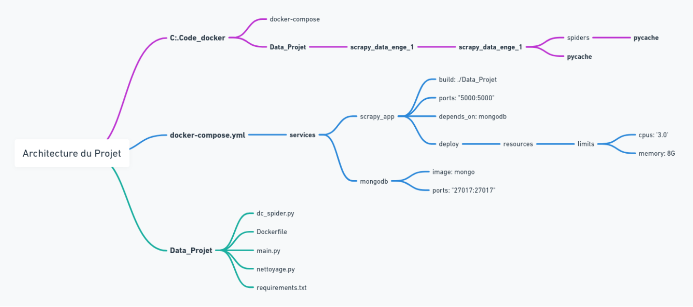

Nous avons décidé de ne pas mettre le fichier avec l'application Dash car elle n'est pas fonctionnelle.

### Dash 
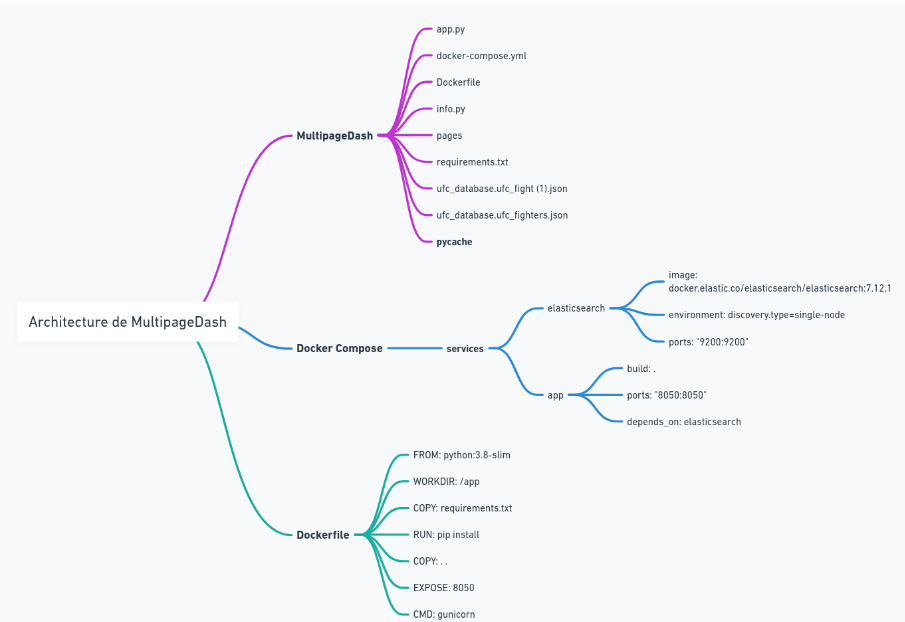

## Qu'est-ce que l'UFC ?

### Ultimate Fighting Championships :

L'Ultimate Fighting Championship, communément appelé l'UFC, est la plus grande organisation mondiale de combat libre (Mixed Martial Arts, MMA). Fondée en 1993, l'UFC a radicalement transformé le paysage des sports de combat en offrant une plateforme où les combattants de différentes disciplines martiales peuvent se mesurer dans un environnement sans restriction.

## Introduction
Pour ce projet, nous avons décidé de scraper le site de l'UFC car nous sommes passionnés par les sports de combat. Voici l'URL concernée : 
"http://ufcstats.com/statistics/events/completed".

### Scrapy

Nous avons commencé par scraper les données des combattants, c'est-à-dire toutes leurs caractéristiques. Pour cela, nous avons utilisé le code suivant :

- Photo du code Scrapy 1:
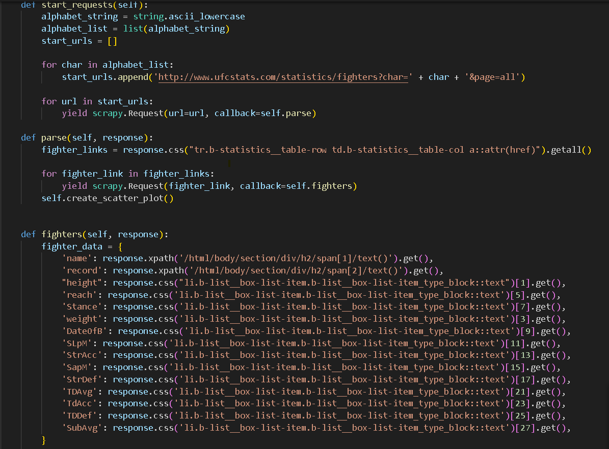

Ensuite, nous avons effectué un deuxième scrapy afin de récupérer les données des combattants.
- Photo du code Scrapy 2 :
 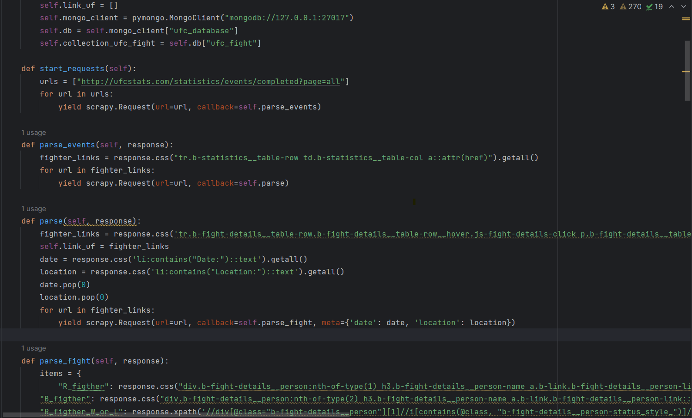

Dans ces scripts, nous parcourons plusieurs pages et scrap les données qui nous intéressent. Ensuite, nous procédons à un nettoyage des données pour les rendre plus lisibles et plus simples à analyser. À chaque appel récursif, nous intégrons les données dans notre base de données MongoDB, même si, après analyse, cette solution ne semble pas la plus adaptée en raison de sa complexité.

Nous avons effectué plusieurs améliorations dans notre script Scrapy. Dans le `DC_spider`, nous avions initialement effectué un nettoyage de données trop agressif, ce qui a entraîné une perte significative de données. Après avoir allégé cette étape, nous sommes passés de 3500 lignes et 135 colonnes à 6500 lignes, et après quelques améliorations, à 7133 lignes.

Pour améliorer notre script Scrapy, nous avons pris plusieurs mesures :
1. Nous avons mis en place un bulk pour l'intégration des données dans MongoDB, ce qui a réduit le temps de traitement de 2.89 secondes à 2.74 secondes par page scrapée.
2. Nous avons ajusté les paramètres `CONCURRENT_REQUESTS` et `CONCURRENT_REQUESTS_PER_DOMAIN` et trouvé que les valeurs 32 et 5, respectivement, offraient les meilleurs résultats, réduisant le temps de traitement à 1.77 secondes.
3. Nous avons introduit une fonction `safe_get` pour gérer les cas où un combattant est mis KO, évitant ainsi des erreurs dues à l'absence de données. Cependant, cette modification n'a pas amélioré les performances comme espéré, et le temps de traitement est remonté à 2.60 secondes.

Au final nous avions un code qui ressemble a cela comme nous n'avons pas eu le temps de l'intégrer dans notre projet nous avons décidé de mettre le fichier python dans le dossier vous pourrez le parcourir voici un aperçue:

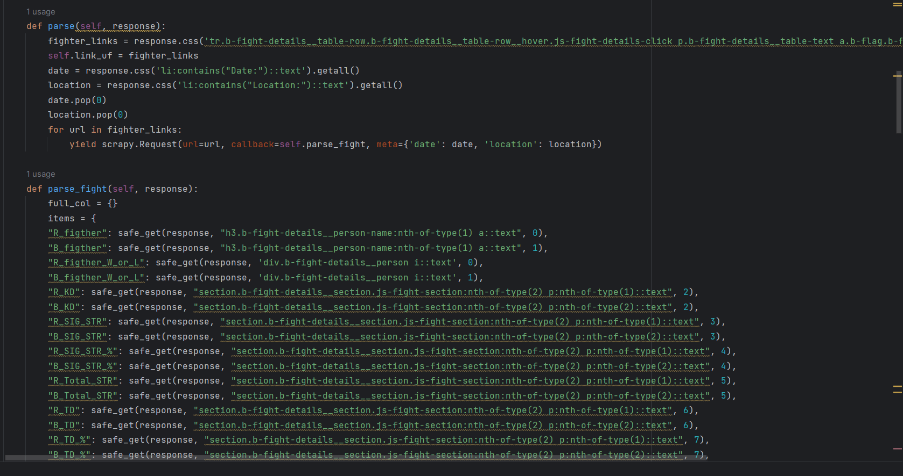

Faute de temps, nous n'avons pas pu intégrer la version améliorée du script à notre projet en raison d'une petite erreur dans le code qui affectait le bulk, nous laissant avec un dataset de 7222 lignes et une colonne.

### Nettoyage des données

Nous avons commencé par nettoyer les données en retirant tous les caractères spéciaux. La première étape consistait à nettoyer la colonne `class` pour la remplacer par des catégories, ce qui s'est avéré relativement simple car les données étaient bien structurées. Après, nous avons remplacé les différentes valeurs manquantes par catégorie de poids, ce qui est plus précis.

L'un des plus grands défis que nous avons rencontrés dans ce projet est la transformation des données de localisation en latitude et en longitude, ce qui a pris énormément de temps. Nous avons réglé ce problème en créant une liste regroupant toutes les localisations car il n'y avait que 182 localisations uniques pour 7222. Il est inutile de parcourir le dataset ligne par ligne pour actualiser les longitudes et latitudes, cela nous fait juste perdre des performances.

Le plus gros du travail a concerné le dataset sur les caractéristiques des combattants, qui était moins bien structuré. Beaucoup de valeurs manquantes étaient dues à une mauvaise documentation sur le site de l'UFC. 

Voici a quoi cela pouvait ressembler:
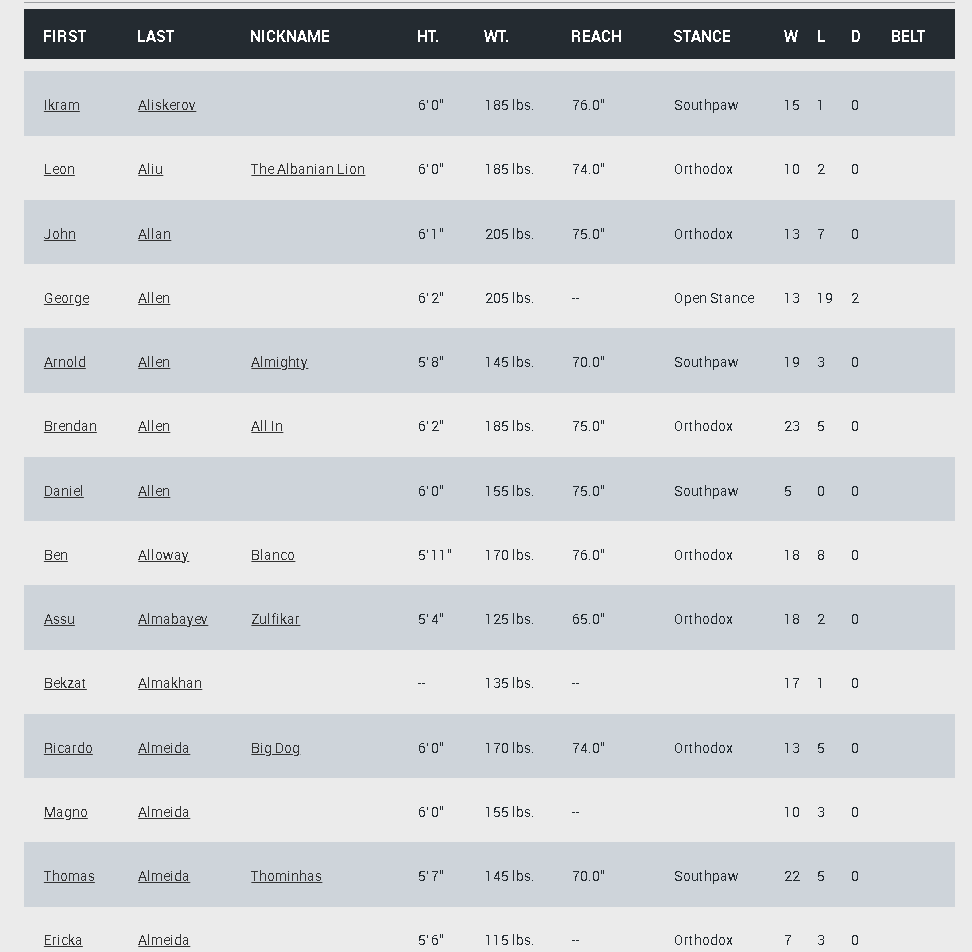

On peut y voir des données manquantes réparties un peu partout. Pour gérer tout cela, nous avons d'abord créé une nouvelle variable `class` afin d'affiner notre nettoyage. De plus, grâce au premier dataset, une variable `gender` a été ajoutée pour plus de précision.

Pour gérer les données manquantes sur la taille et l'allonge, nous avons remplacé les valeurs manquantes en utilisant la corrélation entre ces deux mesures. Face à la difficulté de remplacer précisément le poids, nous avons opté pour un modèle de machine learning avec une précision de 70%, ce qui est satisfaisant étant donné que l'optimisation maximale n'était pas l'objectif principal de ce projet.

### App Dash

Analyse des Performances des Combattants UFC

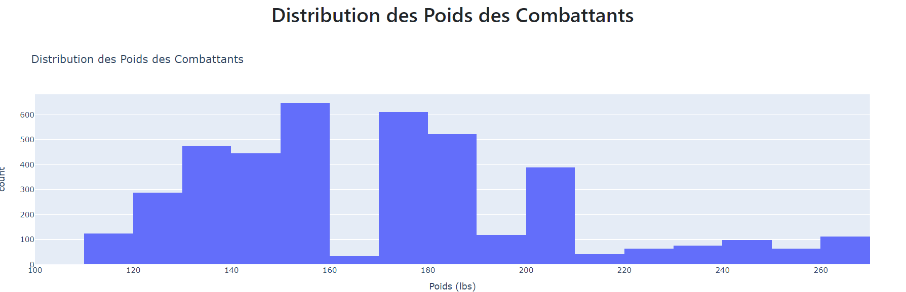

L'analyse montre que les combattants entre 25 et 30 ans tendent à infliger un pourcentage plus élevé de coups significatifs au corps, ce qui peut indiquer une agressivité accrue ou une technique plus raffinée dans cette tranche d'âge.

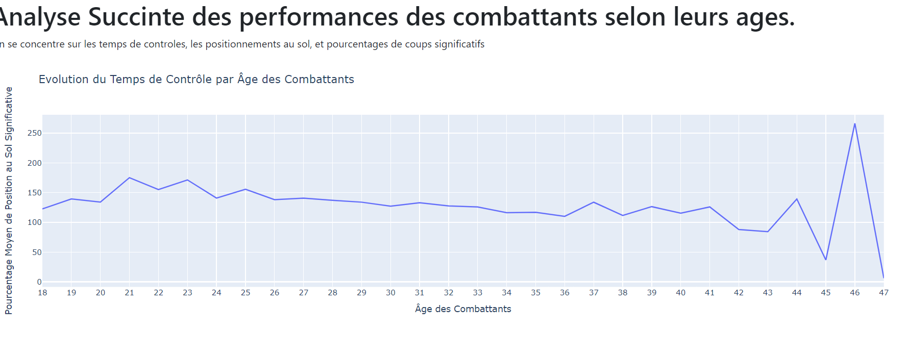

Ici, il est intéressant de constater qu'il n'y a pas de corrélation claire entre la précision des frappes et la défense contre les frappes. Certains combattants ont une excellente précision sans nécessairement avoir une défense supérieure, ce qui pourrait suggérer des stratégies de combat orientées vers l'offensive.

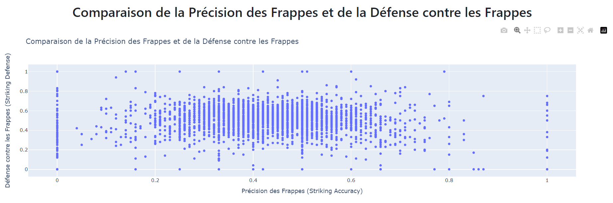

La défense contre les takedowns semble être répartie uniformément à travers toutes les tailles de combattants. Cela suggère que la capacité de défense au sol n'est pas nécessairement influencée par la taille du combattant contrairement à ce que l'on pourrait penser. 

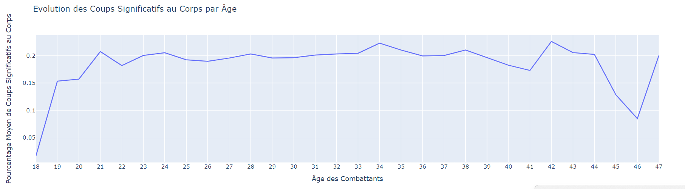

Les combattants plus jeunes semblent passer plus de temps en position dominante au sol, ce qui pourrait refléter une meilleure condition physique ou des compétences plus développées en grappling (lutte au sol) .

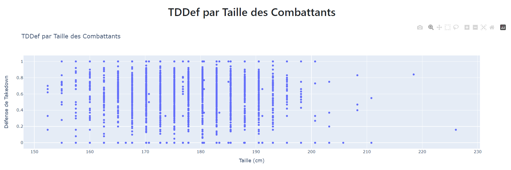

La majorité des combattants se situent dans les catégories de poids moyen, avec moins de combattants aux extrêmes légers ou lourds. Ceci est cohérent avec la répartition typique des poids dans la population générale.Notons qu'aucune limite supérieure n'existe pour les poids lourds.

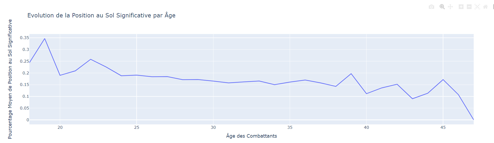

L'analyse montre que le temps de contrôle au sol ne varie pas considérablement avec l'âge des combattants.Une pointe notable est observée chez les combattants de 47 ans, ce qui pourrait être attribué à un échantillon de taille réduite pour cet âge ou à des compétences exceptionnelles de combattants spécifiques (Voir le cas Yoel Romero un combattant encore remarsquable dans la cinquantaine).On remarque tout de même une tendance, les performances de controle au sol demandant du cardio se deterioriant avec l'age. Cela corrobore avec la courbe.

Ces graphiques fournissent des insights précieux sur les tendances et les caractéristiques des combattants de l'UFC, utiles pour les fans, les analystes et les entraîneurs dans la compréhension des aspects stratégiques du combat.
### Docker 

Enfin, nous sommes passés à la conteneurisation de notre code, qui a été plus difficile que prévu. Nous avons utilisé un Docker Compose pour relier toutes les autres images que nous avons dû utiliser, telles que MongoDB, Elasticsearch, etc., que nous avons dû configurer sur différents ports. Nous avons été surpris de voir que nos codes Scrapy ont pris beaucoup plus de temps à s'exécuter, ce qui s'explique par une allocation différente de puissance. Nous avons donc augmenté la puissance allouée à notre conteneur. Après cela, nous avons écrit les différents Dockerfile dans tous les fichiers où cela était nécessaire.

Malheureusement, nous n'avons pas réussi à tout conteneuriser suite à un souci d'orchestration. Tout se passe bien, mais lorsque nous lançons l'app, elle se lance en seconde place et se ferme juste après. Nous ne pouvons donc pas accéder à notre dashboard. Une solution à cela serait d'implémenter un fichier `entrypoint.sh`, mais lorsque nous le faisons, cela fait crasher nos ordinateurs... C'est pourquoi nous avons décidé de vous présenter le scrapy et le dash dans deux dossiers différents, malheureusement. Cela nous attriste et nous ne considérons pas notre travail fini. Nous le finaliserons au cours de l'année, même si cela ne comptera pas pour la note finale.

Notons que le dash app est néanmoins fonctionnel et se base sur les fichiers.json obtenu suite au scraping .L'appli ne s'appuie pas sur notre scrapy ce dernier étant fait séparément par soucis d'optimisation.


### ElasticSearch

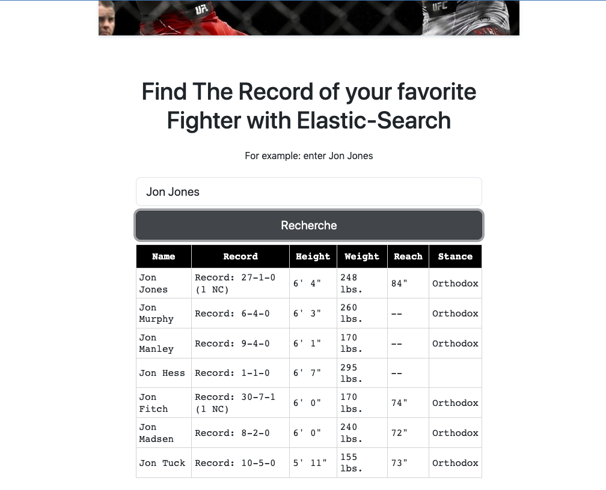

A l'aide d'Elastic Search on implémente un moteur de recherche permettant de retirer des informations à propos des combattants selon leurs noms.


### Copyright 

Nous avons utilisé ChatGPT pour certaines corrections de code :

https://docs.scrapy.org/en/latest/intro/tutorial.html
https://dash.plotly.com/tutorial
https://www.mongodb.com/languages/python
https://dylancastillo.co/elasticsearch-python/
https://community.plotly.com/t/how-do-i-access-plotly-dash-on-a-docker-container/57859/2


# Conclusion 

Cette première version de notre projet en Data engineering  dédiée à l'UFC représente une première plongée dans le monde riche des arts martiaux mixtes. Cependant, comme toute initiative initiale, subsiste le potentiel d'amélioration et d'expansion.

L'inclusion des modifications dans le spider, et plus encore l'amélioration de l'application ainsi que la gestion des données, nous offre énormément d'axes d'amélioration.

En espérant vous avoir communiqué notre passion pour les arts martiaux ! Merci pour votre lecture !


## English Version:

# UFC Data Project

This repository contains two Scrapy scripts integrated with MongoDB for data processing, as well as a dashboard with a search bar implemented using Elasticsearch, within a Python web application framework. The dashboard provides information and analytics on the Ultimate Fighting Championship (UFC) from 1993 to 2024. Users can explore various visualizations and data related to UFC matches, fighters, and more.

## User Guide

Navigate to the downloaded folder and then execute:
For Scrapy:
```
cd Code_Docker
```

To launch the Dash application:

```
git clone https://github.com/gokui9k2/Data_ufc
```

```
cd dash-app-dta
```

```
cd MultipageDash
```

```
docker-compose up --build
```

For the Dash app:
```
http://localhost:8050/
```

## Developer Guide

Language: Python

Framework: Dash Plotly, MongoDB, Elasticsearch

Recommended IDE: VSCode, Docker

### Code Architecture
Scrapy:


We decided not to include the file with the Dash application as it is not functional.

### Dash


## What is the UFC?

### Ultimate Fighting Championships:

The Ultimate Fighting Championship, commonly known as the UFC, is the world's largest mixed martial arts (MMA) organization. Founded in 1993, the UFC has radically transformed the landscape of combat sports by providing a platform for fighters from various martial disciplines to compete in an unrestricted environment.

## Introduction

For this project, we chose to scrape the UFC website due to our passion for combat sports. Here is the relevant URL:
"http://ufcstats.com/statistics/events/completed".

### Scrapy

We started by scraping data about the fighters, specifically their characteristics. To do this, we used the following code:

- Photo of Scrapy code 1:


Then, we performed a second scraping task to collect the fighters' data.
- Photo of Scrapy code 2:
 

In these scripts, we navigate through multiple pages and scrape the data of interest. We then clean the data to make it more readable and easier to analyze. With each recursive call, we integrate the data into our MongoDB database, although after analysis, this solution seems less ideal due to its complexity.

We made several improvements to our Scrapy script. In the `DC_spider`, we initially performed overly aggressive data cleaning, which led to a significant loss of data. After easing this step, we increased the dataset from 3500 rows and 135 columns to 6500 rows, and after further improvements, to 7133 rows.

To improve our Scrapy script, we implemented several measures:
1. We set up bulk integration into MongoDB, which reduced processing time from 2.89 seconds to 2.74 seconds per scraped page.
2. We adjusted the `CONCURRENT_REQUESTS` and `CONCURRENT_REQUESTS_PER_DOMAIN` parameters, and found that values of 32 and 5, respectively, produced the best results, reducing processing time to 1.77 seconds.
3. We introduced a `safe_get` function to handle cases where a fighter is knocked out, avoiding errors due to missing data. However, this modification didn't improve performance as expected, and processing time increased to 2.60 seconds.

In the end, we had a script like this, but due to time constraints, we couldn’t integrate it into our project, so we decided to include the Python file in the folder for you to review. Here's a preview:


Due to time limitations, we couldn’t integrate the improved script version into our project because of a small error in the code affecting the bulk process, leaving us with a dataset of 7222 rows and one column.

### Data Cleaning

We began by cleaning the data by removing all special characters. The first step was to clean the `class` column and replace it with categories, which was relatively simple because the data was well-structured. Next, we replaced missing values with weight class categories for more precision.

One of the biggest challenges we encountered in this project was transforming location data into latitude and longitude, which took a lot of time. We solved this problem by creating a list of all the locations since there were only 182 unique locations for 7222 entries. It was inefficient to loop through the dataset row by row to update the latitudes and longitudes, so this approach saved performance.

The most time-consuming work involved cleaning the fighter characteristics dataset, which was less well-structured. Many missing values were due to poor documentation on the UFC site.

Here’s what it might have looked like:


You can see missing data spread throughout. To manage this, we created a new `class` variable for more refined cleaning. Additionally, a `gender` variable was added for greater accuracy.

For missing height and reach data, we replaced the missing values using the correlation between these two measurements. Given the difficulty in replacing weight data precisely, we opted for a machine learning model with 70% accuracy, which is acceptable considering that optimal optimization wasn’t the main goal of this project.


### Dash App

UFC Fighters Performance Analysis


The analysis shows that fighters between the ages of 25 and 30 tend to land a higher percentage of significant strikes to the body, which could indicate increased aggression or more refined technique in this age group.


Here, it is interesting to note that there is no clear correlation between strike accuracy and defense against strikes. Some fighters have excellent accuracy without necessarily having superior defense, suggesting offensive-oriented fighting strategies.


Defense against takedowns appears evenly distributed across all fighter sizes. This suggests that ground defense ability is not necessarily influenced by a fighter's size, contrary to what one might think.


Younger fighters seem to spend more time in dominant positions on the ground, possibly reflecting better physical conditioning or more developed grappling skills.


The majority of fighters fall into the middle weight categories, with fewer fighters at the extreme lightweight or heavyweight ends. This is consistent with the typical weight distribution in the general population. Note that there is no upper limit for heavyweights.


The analysis shows that ground control time does not vary significantly with a fighter's age. A noticeable spike is observed at age 47, which could be attributed to a small sample size for this age or the exceptional skills of certain older fighters (e.g., Yoel Romero, who remains remarkable into his 50s). Nonetheless, there is a trend indicating that ground control performance, which requires cardio, declines with age. This is supported by the curve.

These charts provide valuable insights into the trends and characteristics of UFC fighters, useful for fans, analysts, and coaches in understanding the strategic aspects of combat.

### Docker

Finally, we moved on to containerizing our code, which was more challenging than expected. We used Docker Compose to link all the other images we needed, such as MongoDB, Elasticsearch, etc., which we had to configure on different ports. We were surprised to find that our Scrapy code took much longer to execute, likely due to a different power allocation. We increased the power allocated to our container, and after that, we wrote the necessary Dockerfiles in all the required files.

Unfortunately, we were unable to fully containerize due to orchestration issues. Everything runs well, but when we launch the app, it runs in second place and closes immediately afterward. We cannot access our dashboard. A solution to this would be to implement an `entrypoint.sh` file, but when we tried this, it caused our computers to crash. Therefore, we decided to present the Scrapy and Dash components in separate folders. Unfortunately, this isn't ideal, and we don’t consider our work complete. We plan to finalize it later this year, though it won’t count for the final grade.

Note that the Dash app is functional and relies on the .json files obtained from the scraping. The app does not depend on our Scrapy as it was performed separately for optimization purposes.

### Elasticsearch


Using Elasticsearch, we implemented a search engine that allows users to retrieve information about fighters based on their names.

### Copyright

We used ChatGPT for some code corrections:

- https://docs.scrapy.org/en/latest/intro/tutorial.html
- https://dash.plotly.com/tutorial
- https://www.mongodb.com/languages/python
- https://dylancastillo.co/elasticsearch-python/
- https://community.plotly.com/t/how-do-i-access-plotly-dash-on-a-docker-container/57859/2

# Conclusion

This first version of our Data Engineering project dedicated to the UFC represents an initial dive into the rich world of mixed martial arts. However, like any early initiative, there remains potential for improvement and expansion.

Incorporating changes into the spider, further enhancing the app, and managing the data provide numerous avenues for improvement.

We hope we’ve shared our passion for martial arts with you! Thank you for reading!


