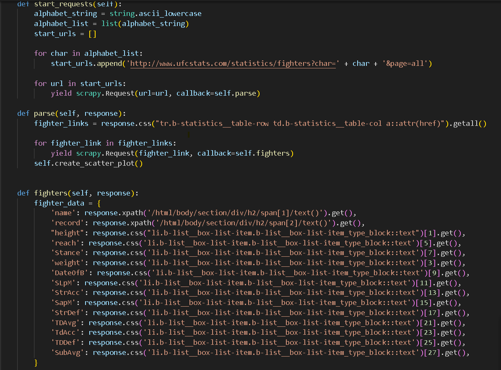

# UFC Data Project

This repository contains two Scrapy scripts that are integrated into MongoDB and then processed, as well as a dashboard with a search bar implemented using Elasticsearch, within a Python web application framework. The dashboard provides information and analysis on the Ultimate Fighting Championship (UFC) from 1993 to 2024. Users can explore various visualizations and data related to UFC matches, fighters, etc.

## User Guide

Navigate to the downloaded folder and perform the following:

For Scrapy:
```bash
cd Code_Docker
```

To launch the Dash application:
```bash
git clone https://github.com/gokui9k2/Data_ufc
cd dash-app-dta
cd MultipageDash
docker-compose up --build
```

For the Dash app:
http://localhost:8050/

## Developer Guide

Language: Python

Framework: Dash Plotly, MongoDB, Elasticsearch

Recommended IDE: Vscode, Docker

### Code Architecture

Scrapy:


We decided not to include the Dash application file because it wasn't fully functional.

### Dash


## What is the UFC?

### Ultimate Fighting Championship:

The Ultimate Fighting Championship, commonly known as UFC, is the largest mixed martial arts (MMA) organization in the world. Founded in 1993, UFC has drastically changed the landscape of combat sports by offering a platform where fighters from various martial disciplines can face off in an unrestricted environment.

## Introduction

For this project, we decided to scrape data from the UFC website because we are passionate about combat sports. The URL in question is:
"http://ufcstats.com/statistics/events/completed".

### Scrapy

We started by scraping fighter data, specifically all of their characteristics. To do this, we used the following code:

- Scrapy Code Photo 1:


Then, we performed a second scrape to gather data on the fighters.
- Scrapy Code Photo 2:


In these scripts, we loop through multiple pages and scrape the data we are interested in. Afterward, we clean the data to make it more readable and easier to analyze. For each recursive call, we integrate the data into our MongoDB database, although this solution didn’t seem the most suitable after further analysis due to its complexity.

We made several improvements to our Scrapy script. In the `DC_spider`, we initially cleaned the data too aggressively, resulting in a significant loss of data. After simplifying this step, we increased the dataset from 3,500 rows and 135 columns to 6,500 rows, and after a few further improvements, we ended up with 7,133 rows.

To improve our Scrapy script, we took several measures:
1. We implemented bulk integration into MongoDB, reducing the processing time from 2.89 seconds to 2.74 seconds per scraped page.
2. We adjusted the parameters `CONCURRENT_REQUESTS` and `CONCURRENT_REQUESTS_PER_DOMAIN` and found that values of 32 and 5, respectively, yielded the best results, reducing processing time to 1.77 seconds.
3. We introduced a `safe_get` function to handle cases where a fighter is knocked out, avoiding errors due to missing data. However, this change didn’t improve performance as expected, and the processing time went back up to 2.60 seconds.

In the end, we had a code similar to this, though we didn’t have time to integrate it into our project, so we decided to place the Python file in the folder for you to explore. Here’s a preview:


Due to time constraints, we weren’t able to integrate the improved script version into our project because of a small error in the code that affected the bulk integration, leaving us with a dataset of 7,222 rows and one column.

### Data Cleaning

We started by cleaning the data by removing all special characters. The first step was cleaning the `class` column to replace it with categories, which was relatively simple because the data was well-structured. After that, we replaced missing values based on weight class, which was more accurate.

One of the biggest challenges we faced in this project was transforming the location data into latitude and longitude, which took a lot of time. We solved this problem by creating a list of all the locations since there were only 182 unique locations for 7,222 records. There was no need to iterate through the dataset line by line to update the longitudes and latitudes, as this would only reduce performance.

The biggest task was cleaning the dataset on fighter characteristics, which was less structured. Many missing values were due to poor documentation on the UFC site.

Here’s how it could look:


We can see missing data scattered throughout. To manage this, we first created a new variable `class` to refine our cleaning. Additionally, thanks to the first dataset, a `gender` variable was added for more precision.

To handle the missing data for height and reach, we replaced missing values using correlation between these two measurements. Given the difficulty of accurately replacing weight, we opted for a machine learning model with an accuracy of 70%, which was satisfactory since maximal optimization wasn't the main goal of this project.

### Dash App

#### UFC Fighter Performance Analysis


The analysis shows that fighters between the ages of 25 and 30 tend to land a higher percentage of significant strikes to the body, which could indicate increased aggression or more refined technique in this age range.


Here, it is interesting to note that there is no clear correlation between strike accuracy and defense against strikes. Some fighters have excellent accuracy without necessarily having superior defense, suggesting offensive-focused fighting strategies.


The defense against takedowns seems evenly distributed across all fighter sizes. This suggests that takedown defense isn’t necessarily influenced by a fighter’s size, contrary to what one might think.


Younger fighters seem to spend more time in dominant positions on the ground, which could reflect better physical conditioning or more developed grappling skills.


The majority of fighters fall within the middleweight categories, with fewer fighters in the extreme light or heavy categories. This is consistent with the typical distribution of weight classes in the general population. Note that there is no upper limit for heavyweight.


The analysis shows that ground control time doesn’t vary significantly with fighter age. A notable spike is observed at age 47, which may be attributed to a small sample size for that age or exceptional fighter skills (e.g., Yoel Romero, a remarkable fighter in his 50s). However, there is a trend where ground control performance, which requires cardio, deteriorates with age. This aligns with the curve.

These charts provide valuable insights into UFC fighters' trends and characteristics, useful for fans, analysts, and trainers in understanding the strategic aspects of the sport.

### Docker

Finally, we moved to containerizing our code, which turned out to be more difficult than expected. We used Docker Compose to link all the other images we needed, such as MongoDB, Elasticsearch, etc., which we had to configure on different ports. We were surprised to see that our Scrapy scripts took much longer to execute, which is explained by a different allocation of resources. We increased the power allocated to our container, and after that, we wrote the necessary Dockerfiles in all the relevant files.

Unfortunately, we weren’t able to fully containerize everything due to an orchestration issue. Everything works fine, but when we launch the app, it launches second and then immediately shuts down, preventing access to the dashboard. A solution would be to implement an `entrypoint.sh` file, but when we did so, it caused our computers to crash... That’s why we decided to present the Scrapy and Dash files in two separate folders. This is disappointing, and we don’t consider our work finished. We plan to finalize it over the course of the year, although this won’t count towards the final grade.

Note that the Dash app is functional and relies on the `.json` files obtained after scraping. The app does not depend on our Scrapy code, which was done separately for optimization purposes.

### ElasticSearch


Using ElasticSearch, we implemented a search engine to retrieve information about fighters based on their names.

# Conclusion

This first version of our Data Engineering project dedicated to the UFC represents an initial dive into the rich world of mixed martial arts. However, like any initial attempt, there remains room for improvement and expansion.

Incorporating the changes into the spider, and further improving the application and data management, provides plenty of opportunities for improvement.

We hope we’ve shared our passion for martial arts with you! Thanks for reading!


