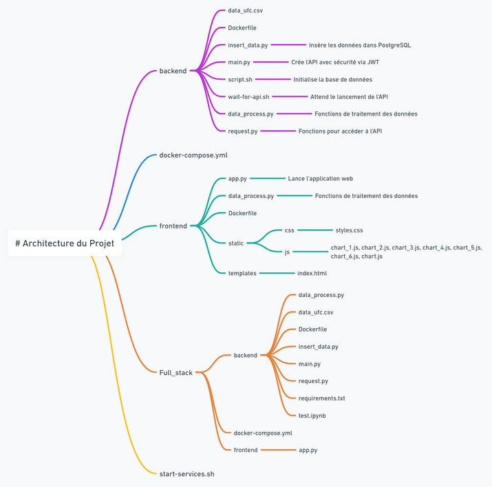
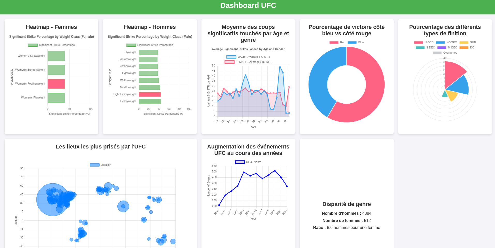

# FULL STACK DATA

Cette application utilise Dash, un framework Python, avec Flask et Docker pour la mise en conteneur.

## Architecture



## Guide du Développeur

- **Langage** : Python
- **Framework** : Dash
- **IDE recommandé** : Visual Studio Code ou PyCharm

## Guide Utilisateur

Pour lancer ce projet, exécutez la commande suivante :

```bash
docker-compose up --build
```

Voici un aperçu de notre application :



### Comment cela fonctionne ?

### Backend :

#### `insert_data.py`

En début de projet, nous nous sommes concentrés sur l'insertion des données dans notre base de données PostgreSQL. Pour cela, nous avons d'abord défini les types des différentes variables dans le fichier CSV afin d'éviter tout problème de type lors de l'utilisation de cette base de données. Pour éviter les erreurs de duplication, nous avons décidé de supprimer les tables existantes avant chaque insertion. Ensuite, nous avons intégré les données par lots de 1000 lignes.

#### `main.py`

Dans ce fichier, nous avons initialisé différentes fonctions pour sécuriser l'accès aux routes de l'API en utilisant des tokens JWT. Pour garantir la confidentialité, nous stockons le nom d'utilisateur et le mot de passe nécessaires pour accéder à l'API dans un fichier `.env`. Les données sont ensuite récupérées via des requêtes SQL en utilisant SQLAlchemy. Pour éviter les erreurs de format, nous avons défini un schéma de données avec des classes, notamment `FighterData`, qui facilite la gestion des données sous forme de liste. Bien que nous aurions pu utiliser un dictionnaire, ce format est plus pratique pour la création de dataframes.

Nous avons également rencontré des erreurs dues au fait que l'API n'était pas prête au moment des requêtes initiales. Pour y remédier, nous avons créé deux scripts `.sh` : `script.sh` et `wait-for-api.sh`, qui permettent de s'assurer que l'API est bien prête avant d'envoyer des requêtes.

### Frontend :

#### `request.py`

Ce fichier contient les fonctions nécessaires pour accéder à l'API.

#### `data_process.py`

Ce fichier regroupe toutes les fonctions nécessaires pour traiter les données et créer les graphiques.

#### `app.py`

Ce fichier initialise l'application Flask et passe les données traitées à la page `index.html` pour un rendu dynamique en JavaScript.

### Docker :

En ce qui concerne Docker, nous avons trois services :

- Base de données PostgreSQL
- API
- Application web

## Conclusion

Ce projet nous a permis de découvrir Docker plus en profondeur et de gérer une application distribuée, ce qui diffère d'un simple lancement en local. Nous avons dû bien orchestrer nos services pour assurer un fonctionnement sans erreur. Nous avons également expérimenté avec la bibliothèque JavaScript Chart.js et envisagé une version en React. 

Nous serions ravis de recevoir vos retours sur notre travail ! 


